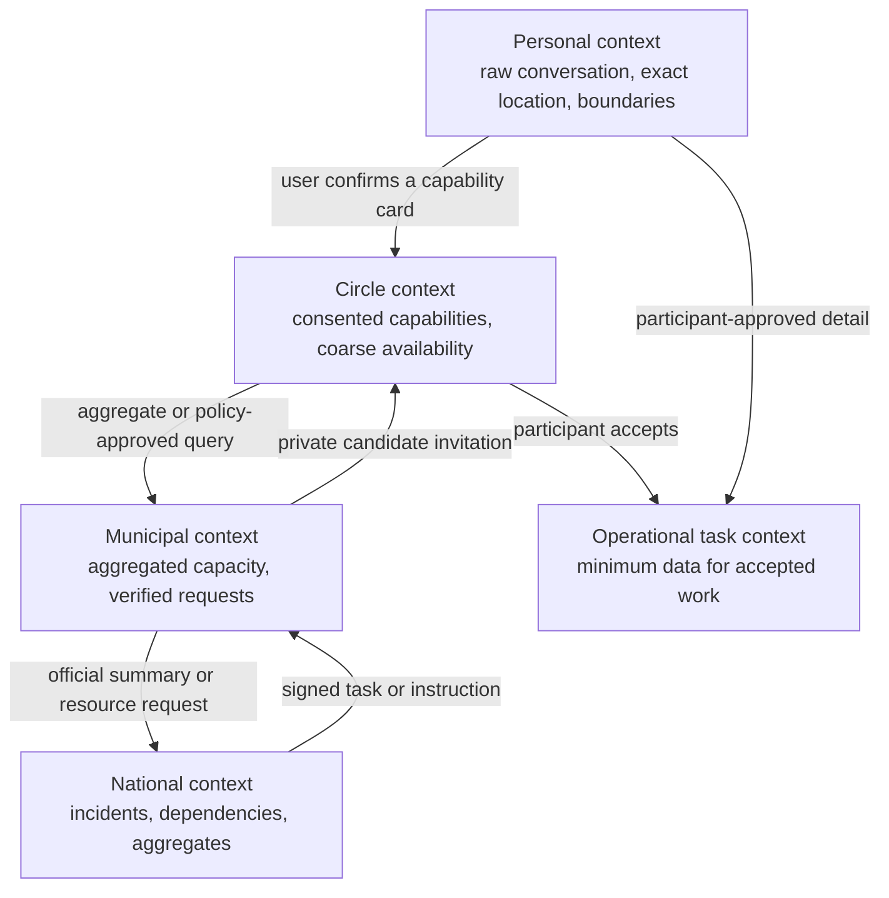
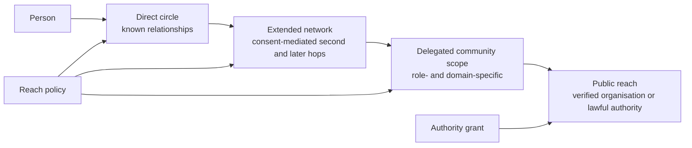
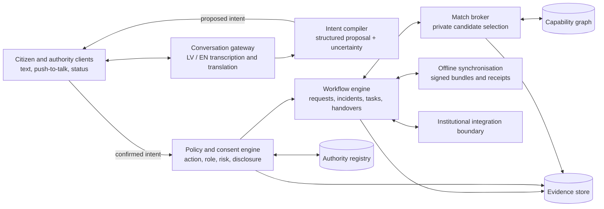

# Atbalsts architecture

**Version:** 0.3 coordination vertical slice  
**Initial scope:** adults in Riga; Latvian and English; invite-only community exercises  
**Expansion path:** Riga neighbourhoods → Riga municipality → other municipalities → national federation  
**Operational posture:** exercise-first, authority-governed, offline-ready

## 1. Purpose

Atbalsts is a coordination layer between residents, trusted communities and competent authorities. Each person works inside a context shaped by their relationships, participation, responsibilities and active situations. The system lets people describe goals, needs, perspectives, capabilities and resources in ordinary language, converts those descriptions into explicit and consented records, and helps an authorised coordinator find and engage appropriate contributors.

Atbalsts is not a replacement for 112, official early warning, the State Fire and Rescue Service (VUGD), municipal civil-protection command or the Crisis Management Centre. It is designed to make community capacity legible and actionable under those structures.

Latvia's Civil Protection and Disaster Management Law includes society within civil protection and gives VUGD and municipalities powers to involve natural persons, legal persons and their resources in defined circumstances. The final operating model must be agreed with the competent institutions; the software does not create legal authority.

## 2. Outcomes

The platform should make four things reliably possible:

1. A resident can ask for information or low-risk help without knowing which person to contact.
2. A resident can offer capabilities or resources without publishing a directory of their identity, address or possessions.
3. An authorised coordinator can determine whether suitable capacity exists and privately invite eligible people.
4. Every consequential interpretation, disclosure, instruction, acceptance, handover and outcome can be reconstructed.

## 3. Non-goals for the first release

- Automated emergency-call classification or emergency-service dispatch.
- Autonomous declaration or confirmation of an incident.
- Autonomous assignment of a person to physical work.
- Medical triage or treatment coordination.
- Tasks involving minors, weapons, cash transfer or hazardous intervention.
- A public map of identifiable citizens or private resources.
- A universal trust, popularity or social-credit score.
- Replacement of institutional command, case-management or early-warning systems.
- Use of a blockchain or experimental privacy system before the operational model is validated.

## 4. Governing principles

### Authority is explicit

Every official action has a verified issuer, role, jurisdiction, incident, permitted action and expiry. The interface visibly distinguishes community, exercise and live incident modes.

### Interpretation is not execution

AI may translate natural language into a proposed structured record. A deterministic policy and workflow layer decides whether an action is permitted. Consequential operations require explicit human confirmation.

### No open people directory

Participants interact with a match broker. A coordinator asks whether appropriate capacity exists; they do not browse a national inventory of named people and private equipment.

### Minimum necessary disclosure

The system reveals progressively more information only as a request becomes legitimate and the participant accepts it.

### Declining is safe

No response means unavailable. A person may decline without explanation. Declining does not lower a public score.

### Time is part of every claim

Availability, resource access, credentials, authority and incident status expire or require reconfirmation. Stale data is visibly stale.

### Degraded operation is normal

Core objects are compact, signed and synchronisable. The same alert, report, task and receipt formats can later travel over internet, local Wi-Fi, Bluetooth, vehicle gateways, licensed radio or physical store-carry-forward paths.

## 5. Context model

Atbalsts uses explicit context zones rather than one global conversation history.



Promotion between contexts creates a receipt recording purpose, recipient, fields, policy and expiry. Raw personal conversation is never promoted wholesale.

### 5.1 Individual scope and reach

There is no single global community view. Every query is evaluated inside an explicit `ReachScope`:



Reach means the system may privately test suitability or deliver a bounded invitation. It does **not** mean that a user can browse names, social connections or private resources in that network.

Reach can expand in three ways:

1. a person explicitly connects or delegates access;
2. a situation owner approves a wider invitation envelope for that situation;
3. a domain-specific coordination grant is earned through completed work, verified outcomes, sponsorship and training.

Expansion is never driven by a single reputation or social-credit score. A `ReachGrant` is specific to a domain, geography, action, maximum audience, risk class and expiry. Evidence used for a grant is visible to the person, contestable and revocable. Declining invitations or expressing an unpopular perspective does not reduce reach.

Government reach is not “high reputation”. It is a different grant type backed by verified institutional identity, jurisdiction and a legal mandate. A competent institution may publish an official situation or request contributions from all policy-eligible participants, while still receiving only aggregated availability until people accept.

### 5.2 Shared context without flattening perspectives

Every contribution is stored as a typed, attributable `ContributionEnvelope` rather than merged directly into a summary:

```text
contribution_id
situation_id or scope_id
actor_id or protected pseudonym
original content and language
contribution type: observation | interpretation | proposal | decision | outcome
source and evidence references
visibility and permitted purpose
confidence and verification state
created_at, valid_until and supersedes
model transformation and policy versions
```

The shared context shown to a participant is a policy-filtered materialised view over these envelopes. It distinguishes:

- what someone observed;
- what the system inferred;
- what a person proposed;
- what an authorised actor decided;
- what was independently verified; and
- what later corrected or superseded an earlier claim.

Perspectives can therefore be preserved for retrospective analysis without being presented as equal factual claims. Corrections append a new event and point to what they supersede. Personal details can be deleted or cryptographically detached according to retention rules while retaining the minimum non-identifying process evidence required for audit.

### 5.3 Retrospective learning and model improvement

Operational history and model-training data are separate products with separate access policies.

The operational evidence stream may be used to reconstruct why a plan was proposed, which actions were approved, what outreach occurred, how the situation changed and what outcome was recorded. A derived improvement dataset contains only approved fields, provenance, lawful purpose, retention period and a reproducible transformation manifest.

The preferred learning targets are action outcomes rather than private conversation content:

- which clarification reduced later failure;
- which plan matched the actual resource requirement;
- how quickly different outreach envelopes filled roles;
- where a suggested action was corrected or rejected;
- which conditions predicted cancellation, overload or unsafe escalation; and
- whether performance differed materially across places, languages or groups.

Raw conversations, relationship graphs and exact locations are excluded from general model training by default. Personal data requires a defined lawful purpose, minimisation, retention and access controls. Training, validation and test datasets must retain lineage, original collection purpose, preparation history, representativeness checks and bias evaluation. These requirements follow the GDPR principles of purpose limitation, data minimisation and storage limitation, and the EU AI Act's data-governance requirements for high-risk systems.

An action model may recommend the next state transition or outreach envelope, but it cannot bypass the deterministic policy engine. Every learned policy is versioned, evaluated offline against held-out historical situations, tested in shadow mode and approved before it can influence live actions.

## 6. Logical architecture



### 6.1 Citizen and authority clients

- Local-first web application initially; native shell when reliable background peer exchange is required.
- Latvian-default, English-supported interface.
- Typed and push-to-talk input.
- Visible mode, issuer, freshness and connectivity state.
- Local encrypted queue for pending reports and task updates.
- Offline knowledge and map packs.

### 6.2 Conversation gateway

- Transcribes speech and detects Latvian or English.
- Preserves the original utterance and distinguishes it from translations.
- Deletes raw audio after transcription by default, unless deliberately attached as evidence.
- Uses an authority-approved terminology pack for critical concepts.
- Has no direct permission to send alerts, create incidents, contact candidates or assign tasks.

### 6.3 Intent compiler

Maps free language to a small, versioned set of intents:

- `register_capability`
- `register_resource`
- `change_availability`
- `request_help`
- `offer_help`
- `report_observation`
- `ask_information`
- `create_task`
- `accept_task`
- `decline_task`
- `submit_checkin`
- `complete_task`
- `cancel_or_correct`

Output is a structured proposal with confidence, missing fields, source language and the exact source span supporting each extracted field. The user sees and confirms the proposal before it becomes operational.

### 6.4 Policy and consent engine

The policy engine is deterministic and versioned independently of the language model. It evaluates:

- actor and verified authority;
- operating mode;
- incident and jurisdiction;
- request risk class;
- required credential or approval;
- permitted recipients;
- fields permitted at the current disclosure stage;
- notification and contact limits;
- retention and expiry;
- cancellation and escalation.

Every policy decision produces an explanation and trace identifier.

### 6.5 Capability graph

The graph stores claims, not labels attached permanently to people.

Core entities:

- `Person`
- `CommunityCircle`
- `Organisation`
- `CapabilityClaim`
- `ResourceClaim`
- `CredentialEvidence`
- `AvailabilityWindow`
- `GeographicScope`
- `ConsentPolicy`
- `RelationshipEdge` (reserved for later use)
- `Request`
- `Incident`
- `Task`
- `CandidateOffer`
- `Acceptance`
- `CheckIn`
- `Outcome`
- `AuditEvent`

A capability claim contains category, the person's original description, structured attributes, confidence, evidence, permitted uses, geographic scope, visibility, contact rules and expiry.

A resource claim distinguishes ownership, access, operation competence and current availability. Exact storage location and access instructions remain separate sensitive fields.

### 6.6 Match broker

The match broker receives a policy-approved query and returns an eligibility result rather than a directory export.

Candidate filtering order:

1. task jurisdiction and area;
2. prohibited or high-risk activity check;
3. required capability and verification;
4. resource access and operating competence;
5. current availability and explicit boundaries;
6. participant contact permissions;
7. notification fatigue and duplicate request controls;
8. optional familiarity preference in a later release.

The broker contacts a small batch. It expands only when the previous batch declines, expires or explicitly permits widening.

### 6.7 Workflow engine

Requests use a fixed state machine:

```text
DRAFT → CLARIFIED → CONFIRMED → POLICY_CHECKED → MATCHING
      → OFFERED → ACCEPTED → IN_PROGRESS → COMPLETED
                                       ↘ CANCELLED
                                       ↘ ESCALATED
```

Incidents use a separate state machine:

```text
DRAFT → EXERCISE_ACTIVE → EXERCISE_ENDED
DRAFT → LIVE_PENDING_APPROVAL → LIVE_ACTIVE → HANDOVER → CLOSED
```

AI cannot skip states or mutate them directly. Every transition has a named human or system actor, prerequisites and idempotency key.

### 6.8 Authority registry

Authority is represented through signed, short-lived capabilities rather than a global administrator role.

An authority credential includes:

- institution;
- human or service identity;
- role;
- jurisdiction;
- incident scope;
- permitted actions;
- approval ceiling;
- issue and expiry time;
- revocation reference.

Proposed roles for exercises:

- national coordination observer;
- institutional incident owner;
- municipal coordinator;
- volunteer coordinator;
- information verifier;
- audit observer;
- community participant.

Final role ownership must be defined with the Crisis Management Centre, VUGD, Riga municipality and other relevant institutions.

### 6.9 Evidence store

The append-only evidence stream records:

- source input or attachment hash;
- transcription and language;
- extracted proposal and model/prompt version;
- user correction and confirmation;
- policy version and decision;
- candidate query and disclosure set;
- notification, acceptance and check-ins;
- authority approvals and handovers;
- cancellation, outcome and reconciliation.

Users can see events involving their data. Institutional auditors see only the scope needed for their mandate.

## 7. Authority mode

Authority mode is a separately permissioned workspace, not a colour theme on a citizen account.

Required controls:

- hardware-backed or equivalent strong institutional authentication;
- training and live environments with different credentials;
- incident-, time-, action- and geography-scoped permissions;
- two-person approval for broad public messages and defined consequential operations;
- signed official information and cancellation messages;
- formal command handover;
- revocation and emergency suspension;
- human verification of citizen reports;
- clear separation between observation, probable incident and official incident;
- no automatic access to the full capability or social graph.

The initial authority prototype runs in shadow mode: it makes proposals, records simulated decisions and measures outcomes without affecting official dispatch.

## 8. AI action boundary

| Level | AI may do | Human control |
|---|---|---|
| 0 — Local assistance | explain, translate, search approved knowledge, draft | user reviews information |
| 1 — Structure | propose intent, capability or task fields | user confirms or corrects |
| 2 — Recommend | identify policy-eligible candidate set or next step | coordinator selects/approves |
| 3 — Bounded outreach | send a limited invitation under pre-approved rules | participant accepts; coordinator monitors |
| 4 — Consequential operation | not autonomous in the initial system | authorised human approval and explicit participant consent |

The system never autonomously confirms an incident, issues an all-clear, transfers command, prioritises emergency-service dispatch or volunteers a person.

## 9. Risk classes

### Green — community coordination

Examples: event setup, translation, delivering sealed supplies, lending low-risk tools. Policy-approved matching and participant acceptance are sufficient.

### Amber — supervised civil-support task

Examples: operating near a controlled incident area, welfare checks, distribution-point work. Requires a verified coordinator, task-specific safety brief, check-ins and abort conditions.

### Red — professional response

Examples: rescue, medical triage, entry into hazardous areas, policing, evacuation command. Not offered to general participants. Routed to competent authorities and verified professional systems.

## 10. Relationship and familiarity model

V1 records invitation provenance and community membership but does not use social affinity for matching.

The data model reserves a private `RelationshipEdge` for a later opt-in release:

- known directly;
- known through a friend;
- collaborated previously;
- comfortable working together;
- prefer a group;
- do not match together.

Edges should be mutual where they represent a positive relationship. A private exclusion must never be revealed to the other person. Familiarity may affect optional community collaboration but not eligibility to receive public emergency assistance. Invitation is not evidence of competence.

## 11. Data protection

Data is classified into:

- **Public:** signed official information intended for broad distribution.
- **Community aggregate:** capability coverage or gaps that cannot reasonably identify a person.
- **Private matching data:** coarse capability, area, availability and contact policy.
- **Task confidential:** identities and operational details shared after acceptance.
- **Highly sensitive:** exact location, vulnerabilities, private constraints, resource access instructions and relationship exclusions.

Controls:

- encryption in transit and at rest;
- field-level encryption for highly sensitive data;
- purpose-bound access;
- short retention for operational detail;
- availability expiration;
- user-accessible disclosure history;
- export, correction and deletion workflows;
- small-group aggregation thresholds;
- documented break-glass policy, disabled for the initial pilot;
- data-protection impact assessment before a live authority pilot.

## 12. Offline and degraded operation boundary

The online pilot must already use portable domain objects:

- signed alert/update/cancel packet;
- encrypted observation or help request;
- task offer and acceptance;
- authority credential and revocation;
- check-in and completion;
- receipt and acknowledgement.

Each object has an identifier, issuer, creation time, clock uncertainty, geographic scope, sequence, expiry, priority, payload hash and signature. This allows later transport over delay-tolerant channels without redesigning operational meaning.

Conflicting observations can coexist. Conflicting official commands are quarantined for human reconciliation; they are never resolved using last-writer-wins.

## 13. Reliability and development loop

Every workflow is promoted through these gates:

1. define one operational question;
2. collect real Latvian and English utterances;
3. define the correct structured result;
4. write policy and disclosure rules;
5. build the smallest end-to-end slice;
6. test ambiguous, malicious and interrupted paths;
7. run a friends exercise;
8. run authority shadow mode;
9. review evidence, privacy and operational ownership;
10. approve, revise or retire the workflow.

Release evidence includes bilingual intent tests, policy tests, state-machine tests, audit completeness, threat analysis, accessibility checks, recovery tests and exercise outcomes.

## 14. Initial deployment topology

For the first Riga exercise:

- one managed Latvian/EU cloud deployment;
- separate citizen, exercise-authority and administration security domains;
- encrypted primary database and append-only evidence store;
- object storage for attachments with short retention;
- local-first client queues;
- no connection to 112 or live authority systems;
- institutional integration through read-only mock adapters;
- synthetic incidents and adult volunteers only.

Later federation can allow municipality nodes to retain detailed records while exposing only aggregates and signed requests nationally.

## 15. Institutional decisions required

Before a live authority pilot, competent institutions must decide:

1. Which body owns each incident and task category?
2. Who verifies official information and citizen reports?
3. Which volunteer tasks are permitted at each risk class?
4. Which operations require dual approval?
5. What is the formal command-handover mechanism?
6. What information may be retained, by whom and for how long?
7. What is the system of record when Atbalsts disagrees with an institutional system?
8. Which audit evidence and exercise outcomes are required for pilot approval?
9. Who is the data controller and which entities are processors or joint controllers?
10. Which interfaces, if any, may later connect to existing systems?

## 16. Primary references

- [Latvian Crisis Management Centre](https://www.mk.gov.lv/lv/krizes-vadibas-centrs)
- [Civil Protection and Disaster Management Law](https://likumi.lv/ta/id/282333-civilas-aizsardzibas-un-katastrofas-parvaldisanas-likums)
- [European Commission — GDPR processing principles](https://commission.europa.eu/law/law-topic/data-protection/information-business-and-organisations/principles-gdpr_en)
- [EU Artificial Intelligence Act — consolidated text](https://eur-lex.europa.eu/legal-content/EN/TXT/PDF/?uri=CELEX%3A02024R1689-20260727)
- [Latvian Data State Inspectorate — data-protection impact assessment](https://www.dvi.gov.lv/lv/jaunums/dviskaidro-NIDA)
- [OASIS Common Alerting Protocol](https://www.oasis-open.org/standard/cap/)
- [IETF Bundle Protocol v7](https://www.rfc-editor.org/rfc/rfc9171.html)

## 17. Current vertical slice and its boundary

The working prototype now validates one complete interaction pattern:

```mermaid
flowchart LR
    I["Person states an aim"] --> S["System structures known facts"]
    S --> Q["One missing fact is requested"]
    Q --> P["Approach is proposed"]
    P -->|"human approval"| M["Suitable participants are matched"]
    M -->|"separate approval"| V["Invitations enter the prototype queue"]
    V --> R["Participant accepts or declines"]
    R --> U["Plan, remaining need and history update"]
    U --> A["Coordinator adjusts the plan in conversation"]
```



The slice persists `Situation`, `Task`, `Participant`, `Message`, `Proposal` and `ProcessEvent` records in versioned browser storage. It contains no timed success animation: counts and status are derived from recorded state. A participant response is entered through a separate participant view and changes the shared work plan. Proposed changes from the coordinator conversation remain pending until explicitly approved.

This is deliberately not yet a live communications or authority system. No external invitations are sent, matching uses a small synthetic candidate set, identity and permissions are not authenticated, and records remain on one device. The next technical slice must replace browser storage with authenticated server-side records, append-only process events, policy-enforced reach queries and an actual delivery adapter while preserving the same user-visible state machine.
