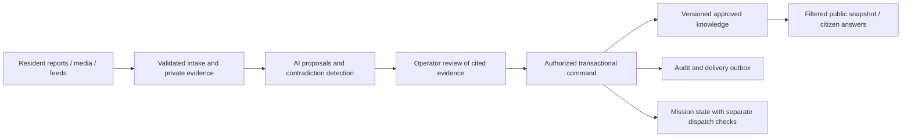

# Atbalsts: foundations for controlled, useful operation

**Architecture and data-hygiene review · 7 September 2026**  
**Reviewed baseline:** GitHub `main`, `7e0468fe29627bea295e292f2e43c1eb552519db`.  
**Scope:** Atbalsts crisis features, citizen reporting/chat, Centre operations, missions, 72h preparedness, persistence and deployment. JCI is excluded.

## Decision in one page

Keep the current product and stack. It already contains a useful operating loop: residents contribute observations; operators review them; situation knowledge informs public answers; missions organize practical help. The next investment should make that loop reliably preserve evidence, enforce permissions and show its true state.

The most consequential weaknesses are **incorrect guarantees**, rather than missing security decorations:

- The database adapter claims to prevent lost updates, but a concurrent ordinary read can defeat its revision check.
- A publication can become public while its operation reports failure and its audit is absent.
- A supposedly grounded model response can contain unsupported text with official source labels. The online 72h endpoint can also replace an emergency response with model output.
- A service-worker message path can cache authenticated API resources despite the fetch handler's exclusion.
- A resident reporting the opposite of a stored fact can be told “the Centre already knows this.”

These were reproduced against the reviewed code using synthetic data and mocked network calls. They are not hypothetical zero-day scenarios or objections to running a demo.

**Recommended sequence:** finish the small containment fixes for emergency routing, browser caching and revision handling; restore a verifiable deployment path; then implement transactional commands and a common evidence/publication model. Complete the mission safety work already underway. Add richer AI behavior after those boundaries hold.

**Testing envelope:** continue supervised, labelled tests using synthetic or deliberately minimized data. Treat AI text as a proposal and mission confirmation as a software workflow being tested. Do not use this review as approval for unattended dispatch or authoritative emergency advice.

## What is current, and what is only planned

| Layer | Evidence at review | Implication |
|---|---|---|
| GitHub `main` | `7e0468fe`; [CI succeeded](https://github.com/goofis11/palidzi/actions/runs/34157772893) | Typecheck, lint, probes and build are real release checks now. |
| Local validation | All 26 existing probes passed in an isolated snapshot | Useful regression coverage, but the failure scenarios below are missing. |
| Deployment | [Latest deploy failed](https://github.com/goofis11/palidzi/actions/runs/34157772882) after all four checks passed; Wrangler reported no `CLOUDFLARE_API_TOKEN` | The immediate failure is deployment configuration, not compilation. Confirm the secret is available to the deployment job. |
| Live domain | Public `/api/health` reported Supabase storage and configured models, but **no build identifier** or newer auth-posture fields | The exact deployed commit cannot be established from this response. Do not assume merged security fixes protect the domain. |
| Mission work | [PR #58](https://github.com/goofis11/palidzi/pull/58), branch `safety/wave-1-dispatch`, commit `4118561` | This work was uncommitted at the start of the review and committed/pushed during it. It is not part of reviewed `main`. |
| Execution plan | [PR #57](https://github.com/goofis11/palidzi/pull/57) proposes `docs/PLAN.md` | Use that as the single execution index once accepted; incorporate this report's corrections rather than maintaining competing backlogs. |

Protections worth retaining include fail-closed auth-provider selection and missing-storage behavior; private upload storage and owner checks; per-operator roster support; audited per-person contact lookup; coarse volunteer-list locations; separate citizen/Centre endpoints; deterministic assistance; suggested versus active knowledge; and explicit publication/withdrawal actions.

The review did not access private production records, change production, spend model/API credits, or overwrite the other contributor's work. Database grants, hosted auth settings, backup restoration, provider data-retention settings and real browser cache contents were not verified. The live check was read-only. No evidence of an actual breach was sought or established.

## Findings that should change the implementation plan

Priority meanings: **P1** should be addressed before wider testing with personal data or operational reliance; **P2** is part of the next foundation increment. “Reproduced” means an isolated code test, not exploitation of the live system.

### R0 · P1 — The release is not identifiable or verifiable

**Observed:** the current deployment job fails for a missing Cloudflare token. Additionally, a build-SHA mismatch in the deployment verification step produces only a warning. The endpoint's `storage: supabase` indicates configured routing, not proof that the database and schema are usable.

**Change:** make release verification fail if the SHA differs, required auth configuration is wrong, or a non-sensitive database/schema readiness check fails. Record the app SHA, schema version and configuration revision together. Keep a previous known-good deployment and document how to restore it. Configure CI credentials through the account owner; do not place them in source or this report.

**Acceptance:** a deliberately wrong SHA or incompatible schema fails the release; a successful deployment serves the expected SHA; rollback is exercised on staging. Public health reveals no operator identities or sensitive configuration. Detailed readiness stays authenticated.

**Evidence:** `.github/workflows/deploy.yml:84–102`; `src/server.ts:3175`, `3978–4085`; deployment run above. Related: #53 and PR #57 Wave 0.

### R1 · P1 — Ordinary reads can defeat optimistic concurrency

**Reproduced:** store A reads revision 1 inside a pending write. Store B writes revision 2. An unrelated GET through store A then updates A's shared revision map to 2. A writes its old content using revision 2, succeeds, and silently removes B's contribution.

This affects the shared storage primitive used for reports, knowledge, events and sessions. It can occur during routine operator polling and citizen submissions; an attacker is not required.

**Change:** revision ownership must belong to the exact value and command that read it. Use an explicit `{value, revision}` result and conditional write, or a transaction-scoped repository object. Plain reads must not mutate another operation's expected revisions. Retry only side-effect-free work. Keep the existing SQL compare-and-set behavior, which is useful when given the correct revision.

**Acceptance:** run two independent adapters plus a concurrent GET; both contributions survive or one command receives an explicit conflict. A stale browser edit must receive `409` with a refresh/diff path, rather than silently overwriting a newer change. Test across processes against disposable Postgres as well as mocks.

**Evidence:** [`src/lib/storage/supabase.ts:33–84`](https://github.com/goofis11/palidzi/blob/7e0468fe29627bea295e292f2e43c1eb552519db/src/lib/storage/supabase.ts#L33). New finding; do not file it merely as the already-known D1 limitation.

### R2 · P1 — Publication, audit and follow-on actions are not one transaction

**Reproduced:** `publishCenterEvent` saves a public event, then its audit write fails. The caller gets an error although the publication exists. A retry can create another publication. Whole-callback retries can also repeat earlier writes after a later conflict.

**Change:** implement domain commands that atomically write state, mandatory audit and an outbox entry. Give each command an idempotency key and expected version. Send notifications or run model enrichment after commit through the outbox; record delivery success separately. A single atomic JSON-document update is not a transaction across documents. [PostgreSQL transaction semantics](https://www.postgresql.org/docs/current/tutorial-transactions.html) support committing all related changes together or none.

**Acceptance:** fail each storage step in turn: either the entire command commits or no public/mission state changes. Repeating a command key returns the original result. An unavailable notification service leaves a retryable outbox record, not a second publication. Operator A editing an old version cannot overwrite operator B's approval.

**Evidence:** [`src/lib/center-store.ts:135–160`](https://github.com/goofis11/palidzi/blob/7e0468fe29627bea295e292f2e43c1eb552519db/src/lib/center-store.ts#L135); analogous multi-write commands in `mission-store.ts` and `citizen-report-store.ts`. Extends #39: audit atomicity comes before claiming tamper evidence.

### R3 · P1 — AI can replace safety decisions and overstate grounding

**Reproduced:** the model renderer accepts an empty evidence list, or a mixture of one allowed ID and an invented ID, then renders unsupported prose with deterministic source labels. Version normalization also removes `:vN`, weakening the stated version boundary.

More urgently, `answerPreparednessQuestion` correctly detects the test emergency, but the HTTP endpoint wraps the result as `mode: information`, `intent: preparedness`. The general model-enhancement path can replace it. The real request handler accepted a mocked replacement that omitted the emergency instruction. This proves an enforcement gap; it does not measure how often a live model would fail.

**Change, first small PR:** make emergency and abstention decisions typed and terminal at the HTTP/domain boundary. An emergency response never calls a model. Check the selected-map fast path too: it currently precedes the general emergency fast path.

**Then:** separate explanation from fact/action selection. Let models select approved, versioned fact/action IDs and propose prose; render safety-critical instructions from approved text. Require exact evidence versions and reject unknown references rather than silently filtering them. A valid ID is not proof that arbitrary prose is supported. Label reports/social material as untrusted, minimize what reaches providers, and keep publish/contact/dispatch permissions outside the model's capabilities. [OWASP's prompt-injection guidance](https://genai.owasp.org/llmrisk/llm01-prompt-injection/) supports output validation, privilege limits and human approval; prompt wording alone does not establish these boundaries.

**Acceptance:** emergency examples in both languages through the actual HTTP handlers produce zero provider calls; empty/mixed/stale citations cannot yield “grounded” advice; provider failure preserves the approved response; report text asking the model to change instructions cannot publish or initiate contact. Store the model, policy and evidence versions used in a decision, without routinely logging private prompts.

**Evidence:** [`src/lib/llm-agent.ts:537–630`](https://github.com/goofis11/palidzi/blob/7e0468fe29627bea295e292f2e43c1eb552519db/src/lib/llm-agent.ts#L537); `llm-agent.ts:130–180`; [`src/server.ts:3610–3667`](https://github.com/goofis11/palidzi/blob/7e0468fe29627bea295e292f2e43c1eb552519db/src/server.ts#L3610). Extends #33 with an HTTP-level safety regression.

### R4 · P1 — Offline caching bypasses its own API exclusion

**Reproduced:** the service worker's `CACHE_72H_RESOURCES` handler accepts `/api/profile` for caching. `OfflineSupport` can feed it same-origin resources from browser performance entries, which can include API fetches. The fetch handler excludes `/api/`; the message handler does not. Logout does not clear this cache.

This corrects the earlier review's overly broad conclusion that excluding `/api` solved authenticated caching. The cache is not automatically public, but it can retain sensitive responses for later same-origin scripts or someone with access to the same browser profile. Actual retained production contents were not inspected. HTTP `no-store` does not by itself govern the Cache API. [MDN documents this distinction](https://developer.mozilla.org/en-US/docs/Web/API/Cache).

The readiness badge checks only `navigator.serviceWorker.ready`, and essential resource failures are swallowed. A static `v2` name exists; it is not an automatic build-versioned offline package.

**Change:** use one strict cache allowlist for install, fetch and message paths: public 72h shell, hashed assets, versioned guidance. Reject API, authenticated pages, tokens, redirects and unrelated resources. Purge old unsafe cache entries. Activate a new package only when its required manifest verifies; keep the previous complete package until then. Show “ready” only after that check.

**Acceptance:** load authenticated pages, inspect cache keys, logout and switch accounts: no API/profile/contact/report data remains in the service-worker cache. Interrupt one asset download: no green readiness badge. Open offline, upgrade online, restart offline: the checklist still loads. Test signed-in offline access too; failed auth refresh currently selects the guest bag key.

**Evidence:** [`public/sw.js:54–70`](https://github.com/goofis11/palidzi/blob/7e0468fe29627bea295e292f2e43c1eb552519db/public/sw.js#L54); `src/components/OfflineSupport.tsx:10–28`; `Preparedness72hPage.tsx:126–128`; `src/hooks/use-citizen-auth.ts:28–40`.

### R5 · P1 — Context can be related without being equivalent or current

**Reproduced:** with approved text “Ceļš P20 ir bloķēts,” the report “Ceļš P20 vairs nav bloķēts” produces “Centrs to jau zina” followed by the opposite statement. The matcher drops negation and uses word overlap. It can discourage a useful correction.

**Also confirmed in code:** the public event list keeps a published situation after its review deadline, deliberately. The situation chat still requires `expiresAt > now`. The map and assistant therefore disagree about availability after the same deadline. Claim aggregation deduplicates account IDs but calls three accounts “strong,” without evidence of independence or time-based decay. Active knowledge has no validity deadline.

**Change:** distinguish relevance matching from confirmation. A matched topic may show “Current Centre information,” but only structured agreement on subject, property, value and time can justify “already known.” Opposite or ambiguous observations become a proposed change. Separate `reviewDueAt` from `validUntil` and `withdrawnAt`; use one availability policy across map, chat and missions. Show report counts as counts, with age and source independence; require review to change public state.

**Acceptance:** negation and changed-time examples remain reportable; stale knowledge cannot override a newer publication; map/chat agree after a review deadline; three coordinated accounts alone never imply verification. Closing or withdrawing evidence marks dependent knowledge/publications for review.

**Evidence:** `src/lib/knowledge-chat.ts:31–37,116–183`; `src/lib/center-store.ts:34–38`; `src/server.ts:3810–3815`; `src/lib/situation-claims.ts:254–305`; `src/lib/knowledge-base.ts:39–62`. Extends #34 and the context-workspace work.

### R6 · P1 — Data minimization needs allowlisted schemas, not a few removed fields

**Reproduced:** `withoutHealthFlags` clears three booleans but preserves arbitrary notes. The bag endpoint strips conversation, which is good, but stores other incoming fields by spreading the request object. A person's medicine notes can still sync. Online assistant messages/history are also sent to the model; clearing household flags does not sanitize free text.

**Also confirmed in code:** situation chat storage keys contain role, situation and language, but no account identifier (`src/components/Chat.tsx:72–79`). On a shared browser, changing accounts does not by itself separate that local history. The account-scoped bag keys already handle a different part of this problem.

**Change:** define separate `LocalBag`, `SyncedBag` and `ModelContext` schemas. Default synced data to item IDs, bounded statuses, quantities and server-controlled revisions; keep free-text notes local unless the person explicitly chooses to sync them. Reject unknown keys, malformed dates and oversized bodies before storing. Label the data-sharing boundary accurately. Use per-item synchronization with version checks; the present read-then-PATCH and client timestamp comparison cannot safely merge two devices.

**Acceptance:** unknown keys and free-text notes cannot enter the restricted sync payload; oversized or future-dated input cannot poison sync; two devices updating different items preserve both changes. A model prompt-capture test proves exactly which fields leave the server. “Delete my data” traverses derived knowledge, media, caches and backups according to a documented retention process.

Namespace private chat history by account as well as situation; offer a clear guest/shared-device policy. An account-switch test must prove that the next person cannot see the previous person's private messages or drafts.

**Evidence:** `src/lib/preparedness-72h.ts:111–121`; `src/server.ts:1280–1293`; `src/lib/citizen-account-store.ts:317–344`; `src/components/Preparedness72hPage.tsx:278–295`. Related: #51 and P-series data-protection work. No legal-compliance certification is implied by clearing these fields.

### R7 · P1 — Complete dispatch checks at the transition where they matter

**Main:** mission joining checks status, expiry and queue position, not capability or the current parent situation. A mission can outlive withdrawal of its parent. Confirmation is assigned by capacity; reserve promotion is automatic.

**PR #58 progress:** adds minimum briefing/instructions, coordinate bounds and parent checks on create/update; records hazard overlap. Useful work. However, `setMissionStatus` and `joinMission` still lack parent revalidation. The new hazard metadata has no UI consumer in the inspected branch, so recording it does not yet establish that an operator saw it. A hazard radius can mean “affected area,” not necessarily “prohibited entry”; a blanket radius block would be wrong.

**Change:** model a mission's risk class and explicit constraints. Validate current parent version, expiry, safety brief and eligibility when opening, accepting and promoting. For ordinary tasks, preserve open self-selection and label suggested skills honestly. Restricted tasks need a reviewed qualification/authorization policy. Require acknowledgement of changed instructions. On a hazard change, pause new acceptances and notify/check on existing participants; do not silently erase their assignment.

**Acceptance:** create a valid draft, withdraw its parent, then try opening/joining it: refused pending review. An affected-area warning is visible before dispatch. A restricted mission cannot be joined through a direct API call without eligibility. Promotion requests acknowledgement rather than implying the person is now travelling.

**Evidence:** `src/server.ts:1394–1412`; `src/lib/mission-store.ts:95–167`; `src/lib/missions.ts:240–259`; PR #58. Builds on M1–M6; review and extend that PR/workstream rather than recreating it.

### R8 · P1 — Identity, permissions and revocation are still too coupled

**Code-confirmed:** Centre sessions hold an operator name and expiry, with no role/situation scope or roster revision. Removing a roster entry does not invalidate its active session. Citizen sessions last 30 days independently of upstream Auth. The application generally accesses data with the Supabase service-role key.

**Change:** add stable actor IDs, capability grants and a revocation/session version checked at each privileged command. Separate contributor, reviewer, publisher, dispatcher and contact-access capabilities, even if the same two people initially hold several. Scope work to the relevant Centre/situation where appropriate. Use narrow database functions/roles for operations; the model and public read path should not need broad database credentials. Keep service-role access for genuinely privileged server jobs.

Supabase RLS/grants already protect against ordinary direct table access, but the service role bypasses RLS; it is not a defense against a compromised Worker using that role. [Supabase documents this behavior](https://supabase.com/docs/guides/database/postgres/row-level-security). Moving deployment to CI does not eliminate this trust boundary: someone able to deploy arbitrary code can access the Worker's runtime secrets.

**Acceptance:** revoking an operator or “log out all devices” invalidates an existing cookie; a reviewer cannot publish or export contacts; denied cross-situation requests remain denied through direct API calls. Confirm email assurance from provider state rather than assuming every successful auth response means verified email.

**Evidence:** `src/lib/session-store.ts:15–48`; `src/lib/citizen-account-store.ts:214–243`; `src/server.ts:1850–1856`; `src/lib/storage/supabase.ts:15–18`; `src/lib/auth/supabase.ts:103–123`. Related: #38, #44, #46, #53.

### R9 · P2 — Bound cost and media growth before adding automation

**Code-confirmed:** request limiters are in-memory per isolate. The FR24 budget checks affordability separately from recording spend; persistence alone does not make this a spending reservation. Proof uploads are stored before signup/proof-step validation, so failed requests can leave orphaned objects. MIME/size checks exist, but actual image decoding, metadata stripping and deletion are absent from the inspected upload path.

**Change:** use atomic budget reservations per provider/day plus per-actor limits and queue limits. Use a Durable Object or Postgres transaction for authoritative counters; plain eventually consistent KV is not a hard global cap. Release/reconcile reservations with explicit failure states and bound the upstream request so its maximum possible cost fits the reservation. Preserve capacity for important sources instead of letting one social query consume it. Expose last success, next retry and budget exhaustion to operators.

Authorize proof submission before upload; quarantine, decode and validate media, create a metadata-stripped viewing copy, then finalize its record. If originals are needed for evidence, restrict and retain them separately. Garbage-collect abandoned uploads. [Cloudflare's concurrency guidance](https://developers.cloudflare.com/durable-objects/best-practices/rules-of-durable-objects/) is relevant: external I/O can allow interleaving even when a coordinator is used.

**Acceptance:** concurrent callers cannot exceed a configured spend reservation; a failed provider call does not retry indefinitely; invalid mission proof requests create no retained object; expired upload reservations are collected; viewers receive no EXIF location metadata in the ordinary preview.

**Evidence:** `src/server.ts:497–523,1437–1480`; `src/lib/fr24-budget.ts:71–88`; `src/lib/upload-store.ts:54–101`. Related: #36, #37, #40, #51.

## Attack paths to use in controlled tests

| Path | Plausible consequence | Control to test |
|---|---|---|
| Resident/social text → assistant context → fluent recommendation | Operator steering or unsupported citizen guidance | R3: no authority from prose; bounded capabilities and exact evidence. |
| Coordinated accounts repeat one reassuring claim | False confidence that a road/hazard is safe | R5: source independence, freshness and separate publication decision. |
| Stolen operator session or deploy credential | Contact harvesting or unauthorized public changes | R8: revocation, capability scope and independent audit; R0: controlled release. |
| Shared browser → retained API response or chat | Another person reads private history/data after logout | R4/R6: cache allowlist, account separation and purge behavior. |
| Burst of reports, proof uploads or paid-feed requests | Lost writes, storage/cost growth or reduced source coverage | R1/R2/R9: conflict tests, atomic commits, quotas and finalization. |
| Compromised upstream feed | Plausible false content presented as authoritative | Source provenance and plausibility checks; separate received feed data from operator-endorsed instructions. Text sanitization alone cannot verify truth. |

Use synthetic inputs on staging. No distributed attack or credential test against the live site is necessary to prove these controls.

## The target architecture: a modular application with explicit authority

Keep React/TanStack, Cloudflare Workers and Supabase. Extract the long request handler incrementally into domain modules with common validation and authorization. Splitting files improves ownership; it does not itself create a security boundary.



The AI path produces proposals. Public publication, contact lookup and dispatch remain explicit capabilities implemented in code. Keep an inference module without database-write authority; isolate it as a separate Worker later if credential separation warrants that operational cost.

### Six contracts to make explicit

1. **Intake contract:** source ID, actor ID or receipt capability, observed/received timestamps, situation, consent/purpose, schema version, size limit and deduplication key. Client observations are claims, never evidence of verified identity or capability.
2. **Evidence contract:** raw source, exact provenance, evidence version, correction/supersession links, freshness and visibility. Repeated copies of one post are one source. Keep content append-versioned during its retention period, not “immutable forever.”
3. **Decision contract:** actor, required capability, expected situation/evidence version, proposed change, rationale and approval. Accepting a report for review is distinct from confirming its claim and publishing it.
4. **Transaction contract:** all state/audit/outbox writes commit together. Every externally retryable command has an idempotency key. A committed receipt is distinguishable from “saved only on this device.”
5. **Projection contract:** public, operator and model views use explicit field allowlists. They never expose contact secrets or raw evidence merely because those fields were added to an internal type.
6. **Offline contract:** only the versioned public guidance pack and deliberately local user data are offline-capable. Cache completeness, unsynced work and freshness are visible. Offline actions needing authorization remain pending until validated online.

### Storage evolution without a rewrite

Repair R1 first. Then move high-contention records into tables: sessions, reports/evidence, situation versions, knowledge entries, decisions, mission signups, audit entries and outbox messages. Use foreign keys, unique command IDs and expected-version updates. Keep JSON for bounded flexible payloads inside those records, not an entire growing population in one row.

Migrate one domain at a time: add schema and backfill; compare counts and representative records; switch reads/writes with an explicit schema version; preserve a rollback path. Prefer a short controlled write pause for a small test dataset over an untested dual-write migration. Exercise both database and object-storage restoration.

## Data hygiene that supports the product

| Data | Required treatment | Proposed test-stage retention/behavior |
|---|---|---|
| Volunteer identity/contact | Separate from public competency views; purpose-bound lookup; individual access audit | Precise home location optional; coarse region by default. Review/delete dormant profiles under an agreed schedule. |
| Raw reports, replies and context answers | Private evidence, bounded text; preserve original and corrected versions; record observed vs received time | Review for removal/anonymization 30 days after situation closure unless explicitly retained for a stated purpose. |
| Photos and videos | Private original if justified; safe viewing derivative; owner, situation and retention link | Delete abandoned uploads after 24 hours; review attached originals alongside their report. These are proposed defaults to approve, not an existing policy. |
| Approved facts/publications | Versioned, source-linked, visibility-limited; explicit supersession | Preserve a redacted operational history; active factual claims have validity/review times. |
| 72h bag | Separate local notes, synced checklist and model context | Clear local data on request; make account switching/shared-device behavior deliberate. Avoid syncing personal narrative by default. |
| AI requests | Minimized context; permitted providers configured; policy/model/evidence versions recorded | Avoid storing raw prompts by default. Verify the actual provider retention and routing settings before sending private narratives. |
| Audit | Append-only application permissions; actor/action/object/version; minimal sensitive snapshots | Choose a defined retention period; export integrity checkpoints to a separately controlled destination. A hash chain without external anchoring can be rewritten by the same privileged attacker. |

Deletion needs a small dependency graph: account → report → attachment → extracted fact → publication/cache. Delete or redact according to purpose while preserving a non-sensitive tombstone where needed to explain a prior decision. Ensure a backup restore reapplies deletion records. Do not collect additional permanent device fingerprints merely to make corroboration scores look stronger.

For testing, keep synthetic and volunteered personal data in separate environments/projects where practical. An explicit dataset/environment label is more reliable than a title convention. This is about controlling data movement; wholesale demo deletion is not the foundation this review recommends.

## Execution plan: reviewable work packages

Suggested owners are roles, not assignments already made. Respect the agreed split: map/Centre work with that owner; 72h/AI with the cofounder's workstream. Pick one owner for shared storage and `server.ts`; queue overlapping PRs for sequential review.

| Order | Work package | Suggested owner | Definition of done |
|---|---|---|---|
| 1, parallel | **Emergency boundary** (R3 immediate) | AI/72h owner | HTTP regression tests show zero model calls on emergency routes. |
| 1, parallel | **Safe offline package** (R4) | 72h owner | All cache entry points allowlist public assets; upgrade/offline/account-switch tests pass. |
| 1, parallel | **Revision ownership** (R1) | Storage owner | Concurrent writer + reader reproducer no longer loses data. |
| 2 | **Deploy and attest** (R0) | Repo/account owner + release reviewer | CI token available; exact SHA/schema/readiness verified; staging rollback exercised. Ship the containment fixes in the same controlled release where feasible. |
| 2, parallel | **Finish PR #58 at every dispatch transition** (R7) | Centre/mission owner | Open/join/promote revalidate parent and risk; hazard warning is actually displayed. |
| 3 | **Atomic publication first** (R2) | Storage owner + Centre reviewer | One transactional publish command with mandatory audit, idempotency and stale-edit rejection. Reuse the pattern for missions and evidence. |
| 3, parallel | **Context truth and freshness** (R5) | Centre + AI owners | Negation not treated as agreement; unified deadline behavior; versioned evidence proposals. |
| 4 | **Identity/capability and data schemas** (R6/R8) | Auth/storage owner | Session revocation works; allowlisted sync/model/public DTOs; role tests; retention/deletion path. Split into small PRs. |
| 4, parallel | **Budget and media lifecycle** (R9) | Ingestion/storage owner | Atomic reservations, bounded queues, upload finalization and orphan cleanup. |
| 5 | **Controlled feature increments below** | Existing UI/AI owners | Each increment demonstrates the relevant contracts rather than adding a new bypass. |

Estimate and assign these after the owners read the reproducers. Transaction/schema work is materially larger than adding a field check; the existing “about a day” dispatch estimate does not cover qualification, acknowledgement, concurrency and notification handling.

PR #57 is a good place to consolidate ownership. Amend its sequence with R1/R2/R3/R4/R5 rather than blindly shipping current `main` and leaving these as distant AI work. Deployment configuration can be prepared while the small code fixes are reviewed. Do not make all useful engineering wait on an account setting.

Each finding should have: one owner, affected capability, failing test, acceptance criteria, migration/config implications, rollout/rollback plan and proof of the deployed version. Preserve one PR/one concern and one merge at a time; avoid another long chain of dependent branches.

## Functionality after the foundations

These extend capabilities already present. They should improve the user's ability to understand and act, rather than add more panels or more autonomous behavior.

| Feature | User experience | Foundation dependency | First useful acceptance test |
|---|---|---|---|
| **Situation change proposal** | “Report a change” captures observation, time and optional media for this situation. Centre sees current fact beside proposed replacement, evidence, conflicts and approve/reject/ask actions. | R2/R5: evidence versions, atomic decision | A report that a road is now clear creates a proposal; it never silently overwrites the closure. The reporter sees the outcome. |
| **A reliable receipt and follow-up inbox** | Every submission shows local draft, sending, received, under review, clarification requested, used or rejected. Bot questions arrive inside the same situation with a notification. | R2/R8: idempotency, ownership, outbox | Disconnect during submission, reconnect and retry: one report, one receipt, one follow-up. Unacknowledged delivery is not marked read. |
| **“Since you last checked” situation digest** | A compact version-to-version diff highlights changed instructions, new evidence and unanswered questions. Past chat remains readable but is visibly tied to its older context. | R5: version/freshness contract | Returning after a day shows the changed instruction before another stale answer; switching situations carries no facts from the previous one. |
| **Operator decision queue** | One ordered queue shows waiting decisions, reasons, age, source health and uncertainty. Open supporting evidence next to the proposed action. Keep the map dominant. | R2/R5/R8 | A first-time operator can identify what needs a decision without opening every data panel. Bulk agreement never bypasses publication permission. |
| **Useful, bounded Centre copilot** | Ask “what changed?”, “which reports conflict?”, “what should we verify next?” It cites exact evidence and drafts a question or update for review. | R3/R5 | With model access disabled the same facts and controls remain usable. A proposed action requires explicit operator execution. |
| **72h next-small-step companion** | Offer a task such as “check water for this household,” accept out-of-order packing, show packed/missing/needs-review, and schedule expiry reminders by opt-in. Shareable entry remains available without registration. | R4/R6 | Start as guest, pack offline, return next day and later create an account without losing items or uploading private notes. |
| **Mission readiness and acknowledgement** | Separate interested, offered, acknowledged, travelling, on-site and completed states. Show what changed, safe meeting point, required versus suggested skills, and a clear decline/help route. | R2/R7/R8 | A promoted reserve is not counted as travelling until they acknowledge. Changed instructions require acknowledgement; withdrawal notifies affected participants. |
| **Privacy and access controls people can understand** | “What is stored?”, “Who viewed my contact details?”, “My sessions,” “Delete/export,” and a shared-device option. | R6/R8/R9 | End another session and its next request fails; delete a test report and its attachment plus derived references follow the defined policy. |

Priority for visible value: **change proposal + receipt**, then **returning-user digest + decision queue**, then richer mission/72h assistance. Thread scoping and account-based bag keys already exist; improve their versioning and recovery instead of rebuilding those features.

A few operational measures make improvement observable: oldest unreviewed report, time from receipt to decision, proportion of proposals materially edited/rejected, unresolved conflicts, citation rejection rate, offline package failures, unacknowledged mission changes, and source last-success/budget state. Treat these as diagnostic signals, not quotas that pressure operators to approve faster. Establish a test-session baseline before adding more automation.

Defer autonomous dispatch/publication, broad multi-agent orchestration, heavy microservice decomposition, blanket evidence deletion, and blanket blocking of all missions inside an affected area. Preserve the useful human workflow while making its authority and state explicit.

## Verification and handoff

The included [`reproduce.mts`](./reproduce.mts) uses synthetic in-memory storage and mocked model responses. From an isolated checkout of the baseline, run:

```sh
./node_modules/.bin/tsx /absolute/path/to/atbalsts-review-2026-09-07/reproduce.mts
```

It demonstrated R1, R2, the two grounding cases and emergency path in R3, the cache handler in R4, the negation case in R5, and surviving free-text notes in R6. **Its current assertions pass when those defects exist.** Invert and adapt them into release regression tests when fixing the code. They supplement, not replace, database integration tests and browser tests.

Existing 26 probes passed locally. The linked CI/deploy runs show typecheck, lint, probes and build passed for the same baseline. This review did not run a penetration test, authenticate as a production user, test a live model's accuracy, or establish that hosted grants/settings match migrations. Consequently, deployment state and provider data handling remain explicit verification tasks.

The source references in this report are relative to frozen commit `7e0468fe`; PR #58 references are explicitly separate. Existing security documents are useful history, but several status claims are stale. In particular: invalid auth-provider fallback, source URL scheme validation, transport headers and asynchronous chat audit have already changed on `main`; source-domain legitimacy, transactional integrity and actual deployment still need separate evidence.

**Next handoff:** add the new regression cases to the appropriate small PRs, fold the work packages into PR #57's single plan, and review PR #58 for transition-time enforcement. The report and diagnostic files are local artifacts; no application source was changed, merged or deployed by this review.
