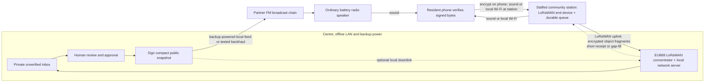
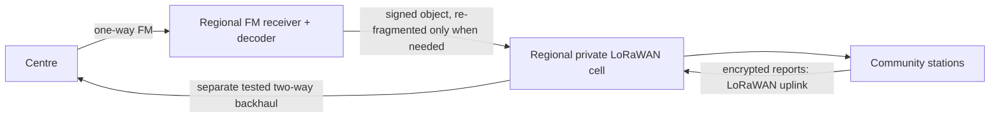

# Atbalsts: bidirectional audio, conventional radio and LoRaWAN pilot

13 September 2026 · Engineering decision draft · Latvia / EU868 assumed

## Decision

Build **one local, centre-led pilot** first: an offline-capable centre, a private EU868 LoRaWAN gateway and network server at the centre, two staffed community stations with LoRaWAN end devices, and phones that exchange short data objects with a station through sound. Add a cooperating FM broadcaster for the one-to-many public update test, with a tested centre-to-broadcaster programme feed and backup power at both ends. Keep public FM, local acoustic sound and LoRaWAN as **three separate transport hops for the same signed/encrypted application objects**. A bridge decodes, validates transport framing, durably queues the original object, and reframes its bytes for the next hop. It does not send PCM audio through LoRaWAN.

This is a tractable system for *sparse reports and compact bulletins*. It is not a general replacement for cellular data. The architecture can be tested without an operational crisis-centre client, and the result would be a fundable R&D demonstration if measured across real phones, RF paths, power loss and congestion. The [reference build and commissioning specification](atbalsts-radio-reference-build-2026-09-13.md) pins the hypothetical Latvian pilot's default kit, packet layouts and site acceptance rules.

## The two directions, exactly

**Public direction:** an operator commits an approved status, the centre signs a small area snapshot, a licensed FM partner injects its *audio-modulated* representation after voice guidance, and a resident holds an already-prepared phone by any ordinary radio speaker. The phone reconstructs the whole object, verifies the centre's signature, and then updates its offline view. Scheduled repetitions help late listeners. The centre-to-broadcaster feed and the broadcaster itself must also survive the outage; if they are in separate buildings, that feed is another backhaul to specify and test. If a station has an FM receiver, take its line output directly into the station decoder; avoid a room microphone on fixed infrastructure. The station may play the same signed object locally. If LoRa distribution is necessary beyond useful FM reception, the centre should sign a separate, genuinely small LoRa bulletin with limited stated semantics; the bridge cannot extract a partial status from a complete signed snapshot or silently re-sign it.

**Report direction:** a resident near a staffed station creates a constrained observation. The phone encrypts it to the centre *before* storage/transmission, then plays it to the station's microphone. A local station Wi-Fi link is a higher-throughput option to benchmark, and should be preferred for routine reports if real phone tests show it is more reliable; it still works without internet. The station keeps opaque bytes in a durable queue, fragments them for LoRaWAN, and sends them to the centre's local gateway/server. Only the centre decrypts into a private, **unverified** inbox. A staff member investigates before any later public statement. If the centre sends a signed durable-receipt object back, the station can return it over sound or local Wi-Fi when the phone reconnects; the resident may have left before it arrives. A LoRaWAN link ACK is not proof of centre inbox storage. [LoRaWAN confirmed-uplink behavior](https://www.thethingsindustries.com/docs/hardware/devices/concepts/confirmed-uplinks-behavior/).

**Physical boundary:** a normal smartphone has no general-purpose EU868 LoRa transmitter or FM transmitter. Without cellular/internet, the resident must get within acoustic or local-Wi-Fi range of a station to submit a digital report. Public FM cannot take that report back to the broadcaster.

### If the FM receiver or LoRa gateway is remote from the centre

The regional LoRa gateway **must have a surviving path to its network server**. Put a full local LoRaWAN stack and queue at the regional hub, or provide a genuinely resilient LAN to the server. A remote gateway that only forwards packets to a cloud service stops being useful when that connection fails. For return to a distant centre, procure one independent two-way backhaul: an authorized private VHF/UHF data-radio pair with PTT/audio interface, a satellite service with its own power budget, or a known-survivable wired route. A courier carrying signed/encrypted queued objects is a slow last resort. For a private analog radio channel, benchmark an established sound-card packet modem such as [Dire Wolf AX.25/AFSK](https://github.com/wb2osz/direwolf) or the [Codec2/FreeDV VHF 2400B data path](https://github.com/drowe67/codec2/blob/main/README_freedv.md); both sides need measured PTT guard time, half-duplex scheduling and application-level retransmission. FM *broadcast* is not that backhaul. Obtain an appropriate service/partner for private encrypted reports; do not design around public FM or unlicensed use of a voice channel.

The exact **radio → LoRa → radio return** demonstration, if a regional bridge is required, is: centre-approved small signed object → audio modem → authorized conventional radio link or public FM → regional line-out decoder → original object bytes re-fragmented into LoRaWAN → local station/phone. In the other direction: resident phone sound → station → LoRaWAN uplink → regional hub → *authorized two-way* radio data modem (or other resilient backhaul) → centre's private inbox. With public FM on the outbound leg, the inbound radio link is necessarily a different two-way service. Test each directed hop separately, then the whole loop.

## What to obtain for a first field pilot

| Quantity | Item and role | Acceptance at purchase/commissioning |
|---:|---|---|
| 1 | Offline centre workstation or industrial mini-PC, local inbox/queue, separate signing and report-decryption keys, durable storage, battery-backed clock and backup | Reboots without internet; keys are absent from browser bundle; queue and latest signed revision survive abrupt power loss; issue/expiry time remains trustworthy |
| 1 active + 1 spare for pilot | Certified EU868 **multichannel** LoRaWAN gateway using an SX1302/SX1303-class concentrator, antenna, mounting, surge protection, local Ethernet and UPS | Real coverage at both stations; no single-channel gateway; documented legal RF settings. [Semtech SX1302](https://www.semtech.com/products/wireless-rf/lora-core/sx1302) |
| 1 | Local LoRaWAN network/application server on the centre PC with backed-up storage; [ChirpStack Gateway OS Full](https://www.chirpstack.io/docs/gateway-os/image-types.html) on supported hardware is a compact bench option | Gateway-to-server path is local and survives internet loss; OTAA device provisioning, frame counters and backup/restore are tested |
| 2 | Staffed station boxes: low-power computer, **certified EU868 LoRaWAN Class A/C end device**, non-volatile queue, microphone/speaker and controllable audio interface, battery/UPS, optional local Wi-Fi access point | Correct regional firmware; sufficient queue for the specified arrival rate; power-cycle recovery; mic gain and speaker volume reproducible |
| 2 | Battery FM receivers with accessible line output for infrastructure tests; ordinary portable radios for resident speaker tests | Captured off-air waveform and intelligible voice at every test site |
| 4+ | At least two Android and two iPhone models with offline app, preinstalled centre public keys, area registry and a set of test reports | Cold reopen with every network disabled; raw/minimally processed audio path where supported; phone model/OS logged |
| 1 partner | FM broadcaster with written pilot slots, access to its real programme-processing chain, backup power, and a surviving feed from the centre | Legal transmission, agreed voice/data schedule, recording of injected and off-air audio; feed still works with public internet down |
| Shared | RF survey/test kit: calibrated logger or SDR/spectrum tool, antenna and feeder survey, audio recorder, inline attenuator/dummy load for bench work, power meter, spare cables, batteries | Per-site RSSI/SNR, packet outcomes, waveform level and battery runtime recorded |

This list specifies functions rather than a vendor shopping cart: the exact gateway enclosure, antenna, UPS and radios depend on the two sites, terrain and licensed partner. An RF engineer should set antenna height, feeder loss, ERP and channel plan. In Latvia's current frequency plan, **868–868.6 MHz** short-range devices have a 25 mW ERP limit with an alternative ≤1% duty-cycle route; **869.4–869.65 MHz** has different conditions, including 500 mW ERP and an alternative ≤10% duty cycle. These are not blanket permission to run any LoRaWAN channel at 500 mW. Confirm the actual device/channel configuration before radiating. [Latvian National Radio Frequency Plan, rows 48 and 54](https://likumi.lv/ta/id/338729).

### Concrete reference kit and power budget

For procurement conversations, an **example** outdoor gateway is the EU868 version of [RAK7289V2](https://docs.rakwireless.com/product-categories/wisgate/rak7289v2/datasheet/): SX1303, eight channels, IP67, PoE/12 V, external antenna connector. Its vendor documents a [Basics Station connection to ChirpStack](https://docs.rakwireless.com/product-categories/wisgate/rak7289v2/lorawan-network-server-guide/). This is a reference candidate, not a site-specific selection or a claim that this exact gateway has passed our tests. Use **local** wired Ethernet from gateway to the centre PC, with [Basics Station mutual TLS](https://www.chirpstack.io/docs/chirpstack-gateway-bridge/backends/basics-station.html) and credentials provisioned before the outage. A station-node development candidate is the CE-marked EU868 [RAK3172 module](https://docs.rakwireless.com/product-categories/wisduo/rak3172-module/overview/) connected by UART to the station computer; its published profile is LoRaWAN 1.0.3, so verify its firmware, class behavior and counter persistence before treating it as a field device. Choose an assembled, appropriately enclosed and compliant station product for unattended deployment.

For each powered site, measure actual average and peak watts with FM receiver, audio, Wi-Fi and LoRa active. Size usable backup energy as **measured average W × 72 h ÷ derating factor**, then check peak/inrush power and battery temperature. At a provisional 80% usable-energy factor, a 10 W station needs about **900 Wh** for 72 h; a 30 W centre+gateway pair needs about **2,700 Wh**. Those are examples, not device specifications. A broadcast transmitter normally needs a separately engineered generator/fuel arrangement; the broadcaster must certify its own 72-hour programme-feed and transmitter runtime. For any live service, add an overlapping second gateway, a recoverable centre server/key backup, spare station hardware and periodic failover exercises. The one-gateway pilot cannot prove service continuity through a gateway failure.

For the *regional* variant, add a powered regional hub (FM receiver + decoder + local LoRaWAN server/gateway) **and** two endpoints for the independent centre↔hub backhaul. Do not buy that equipment for the first, co-located test until the need and sites are defined.

## Technology profile and trust boundary

- **Application objects:** reuse the tested pilot profile: centre public snapshots as COSE_Sign1/Ed25519, at most 1,024 bytes; private reports as HPKE X25519/HKDF-SHA256/AES-128-GCM, currently 314 bytes. This profile and clean-WAV software tests exist in [the local protocol proof](atbalsts-radio-security-proof/protocol-spec.md); receipts, hardware LoRa transport and operational key handling still need implementation. [COSE](https://www.rfc-editor.org/rfc/rfc9052.html), [HPKE](https://www.rfc-editor.org/rfc/rfc9180.html).
- **Audio modem:** use the existing Atbalsts waveform as a baseline because one offline phone-speaker → MacBook-microphone import succeeded, but benchmark [Rattlegram's open modem](https://github.com/aicodix/rattlegram) as a candidate for better acoustic/FM performance. For any narrowband private VHF/UHF radio link, use a separate modem designed for that voice passband; Codec2's VHF 2400B and Dire Wolf AFSK are candidates. Choose by complete *signed-object* success, time and battery in the actual chain, not the advertised raw bitrate. [Existing one-session review](atbalsts-radio-review/review.md).
- **Phone audio:** on Android, request `UNPROCESSED` only if supported and test fallback, because it behaves like default processing when unavailable; on iOS, test `AVAudioSession` measurement mode, which minimizes processing but can lower playback level. Foreground listening windows and known FM schedules are safer than assuming reliable background capture. [Android audio source](https://developer.android.com/reference/android/media/MediaRecorder.AudioSource), [Apple measurement mode](https://developer.apple.com/documentation/avfaudio/avaudiosession/mode-swift.struct/measurement).
- **LoRa network:** private LoRaWAN star topology with local server, OTAA-provisioned station nodes and persisted state. Use ADR for fixed stations after coverage survey. For the *staffed, externally powered pilot stations*, use Class C to receive delayed centre receipts without waiting for a new uplink, and include its receive power in the 72-hour battery budget. Class A is the battery-first fallback but must poll with an uplink to open receive windows. Class C does not remove gateway duty-cycle or half-duplex constraints. [Class C](https://www.thethingsindustries.com/docs/hardware/devices/configuring-devices/class-c/), [gateway downlink limits](https://www.thethingsnetwork.org/docs/lorawan/limitations/).
- **Bridge protocol:** separate audio/LoRa fragmentation. For a concrete **proposed** LoRaWAN FPort 10 profile, use an 8-byte fragment header: byte 0 = version/type nibbles, bytes 1–4 = 32-bit transfer ID, byte 5 = zero-based fragment index, byte 6 = fragment count, byte 7 = reserved zero. Allocate transfer IDs from a durable monotonic counter per sender, scope them to its provisioned identity, and reuse them on retries. Concatenate indexed payloads and calculate the full SHA-256 object ID *after* bounded reassembly. The final fragment length determines total length; reject conflicting duplicates, impossible counts, unknown versions/types and objects above their type-specific caps. LoRaWAN frame integrity protects each uplink; the COSE signature or HPKE authentication protects the complete application object. The audio modem has independent framing and CRC/FEC. Never trust a CRC, gateway identity or transport ACK as publication authority. Retain the exact signed/encrypted bytes across media; do not deserialize and reserialize at the bridge.
- **Receipts and state:** sign a small receipt only after the centre commits the *whole encrypted envelope* to its durable inbox. Budget that receipt's signature and its possible multi-fragment LoRaWAN downlink. Phone UI distinguishes saved locally, copied to station, centre received, and separately reviewed; no stage means the report is true or help is dispatched. Signed public snapshots bind area, registry, authority epoch, sequence, issued/expiry times and complete area membership. Old audio cannot refresh an expired status. Incoming reports remain private and unverified until an operator approves a new public revision.

### Pinned transport behavior for the pilot

| Boundary | Initial configuration | Reliability rule |
|---|---|---|
| Gateway ↔ local server | EU868 gateway → LoRa Basics Station over authenticated local TLS → ChirpStack Gateway Bridge/server on backup-powered LAN | No cloud dependency or online certificate lookup at outage time; monitor link, restart services, restore from local backup. [ChirpStack Basics Station TLS](https://www.chirpstack.io/docs/chirpstack-gateway-bridge/backends/basics-station.html) |
| Station ↔ LoRaWAN | EU863–870 device profile; OTAA with unique per-device keys; matching and pinned LoRaWAN MAC/PHY versions; **Class C for the powered pilot stations**, ADR after fixed-site survey | Persist join state/counters as required by the selected stack; verify power-cycle/rejoin with the local server, including the post-join uplink needed to enable Class C downlink scheduling; enforce regional payload, ERP and duty budgets. [Class C setup](https://www.thethingsindustries.com/docs/hardware/devices/configuring-devices/class-c/), [Semtech OTAA](https://learn.semtech.com/mod/book/view.php?chapterid=94&id=171) |
| Station report upload | Unconfirmed LoRaWAN fragment uplinks on proposed FPort 10, duty-aware scheduling and jitter; full-envelope hash deduplication at centre | A centre-signed receipt after durable commit is the delivery proof. For the first pilot, if no receipt is received five minutes after the last fragment at the surveyed DR3 core site, retry the **same whole object** with the same transfer ID and exponential backoff; persist the attempt count, stop at report expiry, and bound queue/airtime use. A later selective-fragment request can reduce airtime if measured losses justify its downlink cost. Avoid routine confirmed uplinks because each requires downlink airtime. [Confirmed uplink cost](https://www.thethingsindustries.com/docs/hardware/devices/concepts/confirmed-uplinks-behavior/) |
| Centre receipt return | Centre signs a versioned receipt binding the first 16 bytes of the report SHA-256 ID and durable-commit time; sends it whole when the current downlink payload permits, otherwise fragments it to the Class C station; station presents original signed bytes to the phone when it reconnects | Station verifies signature and matches its queued object before showing “centre received”. If a receipt is lost, station requests it again using the full 32-byte report hash; the centre resends the original signed receipt, subject to downlink quota. A phone that has left must return or use another available channel to obtain it. [Exact proposed 105-byte profile](atbalsts-radio-reference-build-2026-09-13.md) |
| FM / private radio audio | Mono, level-controlled PCM encoder into approved programme or private-radio audio input; receiver line-out into decoder; repeat objects on a published schedule | Pin the chosen modem, sample rate, gain, preamble, FEC, frame size and maximum object size **after off-air comparison**; add PTT guard times and half-duplex ARQ for private two-way radio. |
| Phone ↔ station | Foreground acoustic exchange and an offline local-Wi-Fi alternative; preinstalled app and public keys | Test both phone OS families and retain report bytes until station copy is explicit; phone may return later for a centre receipt. |

The [reference build](atbalsts-radio-reference-build-2026-09-13.md) now pins an initial audio baseline, conservative RF start setting, battery quotation envelopes, the `ATR2` compact report and a signed receipt format. The final waveform, antenna location, radiated power, battery capacity, FM programme slot and private-radio frequency still require the specified real-site tests and broadcaster/radio agreement. Firmware and an installed bill of materials remain implementation work; no site-independent setting can make the service reliable without those tests.

## LoRaWAN capacity is the first feasibility gate

The EU868 reference payload limits are **51 application bytes at DR0/SF12, 115 at DR3/SF9 and 222 at DR5/SF7** (without FOpts). After an illustrative 8-byte fragment header, useful object bytes per uplink are 43, 107 and 214. [EU868 regional reference](https://www.thethingsnetwork.org/docs/lorawan/regional-parameters/eu868/). The table below uses 125 kHz, coding rate 4/5, an 8-symbol preamble, 13 bytes of minimum LoRaWAN PHY overhead, no retries or collisions and all fragments on a *single 1% duty-cycle sub-band*. The “earliest finish” is a best-case legal transmit-spacing bound, **not** a measured delivery time or an RF guarantee. Reproduce it with [the calculation script](atbalsts-radio-eu868-airtime.py); compare final hardware's regional settings and its measured time-on-air before committing to a service promise. [Semtech airtime method](https://www.semtech.com/design-support/faq/P100), [duty-cycle explanation](https://www.thethingsnetwork.org/docs/lorawan/duty-cycle/).

| Object | DR0 / SF12 | DR3 / SF9 | DR5 / SF7 |
|---|---:|---:|---:|
| 128-byte **proposed compact report** | 3 frames; 8.38 s airtime; **9.36 min** earliest | 2; 0.96 s; **1.13 min** | 1; 0.25 s; **0.25 s** |
| 314-byte **existing HPKE report** | 8; 21.36 s; **32.62 min** | 3; 2.01 s; **2.27 min** | 2; 0.57 s; **0.62 min** |
| 1,024-byte **maximum public snapshot** | 24; 66.88 s; **107.13 min** | 10; 6.56 s; **10.16 min** | 5; 1.78 s; **2.46 min** |

The 128-byte report is a **proposed new version**, not implemented. With the existing HPKE suite and a 10-byte header, 32-byte encapsulation and 16-byte AEAD tag, it leaves 70 bytes for padded plaintext. That means a tightly coded category, time and location reference, perhaps a short constrained note; it cannot preserve the current 160-byte-text allowance. Define the reporting task with actual staff before fixing that schema. Keep the 314-byte richer report for higher data rates, station local Wi-Fi or delayed carriage. Do not compress arbitrary private free text and assume predictable size.

At DR0 on the 1% sub-band, the existing report consumes 21.36 seconds of transmission: a single station can send only about **1.7 such reports/hour** on that sub-band even with no retries. A 128-byte report allows about **4.3/hour**. At DR3, ten 128-byte reports/hour use roughly 9.6 seconds of a 36-second/hour 1% budget, leaving limited but real retry headroom. This table estimates **station uplinks**, not gateway downlinks: the configured downlink band may have a different duty budget, but a large object still needs many frames. Gateway downlinks and other users need their own budget, and downlinks temporarily make a typical gateway deaf to uplinks. Public snapshots should therefore ride FM; LoRaWAN should carry sparse reports, small receipts and exceptional gap-fill. If a required station is stuck at DR0 or the survey shows congestion, relocate/raise the gateway, add a gateway, reduce traffic, or choose a different authorized backhaul rather than promising fast reports. [LoRaWAN gateway limitations](https://www.thethingsnetwork.org/docs/lorawan/limitations/).

## Test sequence and go/no-go gates

1. **Freeze the service envelope before coding the bridge.** Choose two named station sites, a centre site, target area, 20 synthetic reports/hour across the two stations as a test load, snapshot size and publication cadence, maximum resident walk-up queue and blackout duration. Record available antennas, FM partner, acceptable reporter wait and how a resident without an app receives voice guidance. The envelope may change after the first survey; the test results must state which envelope they cover.
2. **Prove byte-exact interoperability on a cable.** Exchange known public and sealed objects through independent encoders/decoders on each hop; inject missing, duplicated, out-of-order and malicious frames. A public update applies only after full cryptographic verification. A false but correctly encrypted report remains unverified. Power-cut each queue during write and replay it after reboot. This gate tests protocol and persistence, not RF.
3. **Compare acoustic and local-Wi-Fi last metres on real phones.** Test Android and iPhone at predefined 0.2/1/2 m, speaker levels, late starts, people talking, vehicle/room noise, cases and battery states. Log exact sender manifest, object IDs, recordings when consented, whole-object success and time. Benchmark existing waveform against Rattlegram and, if needed, a slower robust mode. Pick one waveform per actual channel rather than insisting on the same waveform for phone sound, wide FM and narrow private radio. No single clean software WAV or single successful phone session establishes reliability.
4. **Insert real RF one hop at a time.** First test with legal wired/attenuated RF setup; then take injected and off-air recordings through the actual broadcaster's processor and multiple ordinary radios. Measure mono/stereo processing, clipping, band limits and audio level without harming voice intelligibility. Prove the centre-to-broadcaster feed survives loss of public internet and grid power. Separately survey LoRaWAN RSSI/SNR, DR, uplink fragment success, gateway downlink contention and antenna position at both station sites. Keep internet/cellular disabled during the whole test. A broadcaster slot and transmit authority are prerequisites for over-the-air FM trials.
5. **Run the end-to-end blackout exercise.** Shut off internet and cellular, run centre/gateway/stations/radios on backup power, submit synthetic phone reports, induce centre/station restart, delayed/reordered fragments and queue-full conditions, then have a human review a report and issue a separately signed FM bulletin that changes a different offline phone's view. Repeat under scheduled ordinary traffic and with an old/forged public packet. Demonstrate that no forged packet changes public state and no station claims centre receipt before durable commit.

**Provisional pilot gates, not emergency-service guarantees:** At the two surveyed core sites, fixed stations should sustain DR3/SF9 or better under the stated test load, or be redesigned. In each predeclared phone/radio environment, target at least 95 complete, verified public imports in 100 attempts within two scheduled broadcast cycles; report all individual failures and their conditions. For the DR3 core, target at least 95 centre receipts in 100 submitted 128-byte test reports within 15 minutes at the stated 20/hour aggregate load. Require zero unauthorised public-state changes in the negative-test corpus and zero falsely issued “centre received” states. Prove at least 72 hours of operation with measured backup-energy use and real power interruptions. A 100-attempt pilot can expose major problems; it cannot statistically certify 95% population reliability, so production claims need longer, multi-site trials and redundancy.

## What is established today, and what the next funding tranche buys

Existing local work proves the crypto wire format in software, clean audio-WAV decoding and one offline phone-speaker → MacBook-mic import; it **does not** prove reception through FM, iPhone/Android diversity, LoRaWAN hardware, radio backhaul, blackout power or community-scale reliability. [Protocol proof](atbalsts-radio-security-proof/README.md), [one-session review](atbalsts-radio-review/review.md).

The narrow R&D work package is therefore: **(1)** build the bridge/queues and compact-report candidate, **(2)** obtain and survey the above kit and broadcaster access, **(3)** run measured acoustic, FM and EU868 trials, **(4)** perform the closed-loop blackout exercise and publish a reproducible reliability/capacity report. The fundable outcome is evidence that a resident can receive an authenticated bulletin and submit an encrypted observation when the grid and internet are down, with known coverage, latency, power and failure limits. Claim readiness only for the envelope actually demonstrated.
