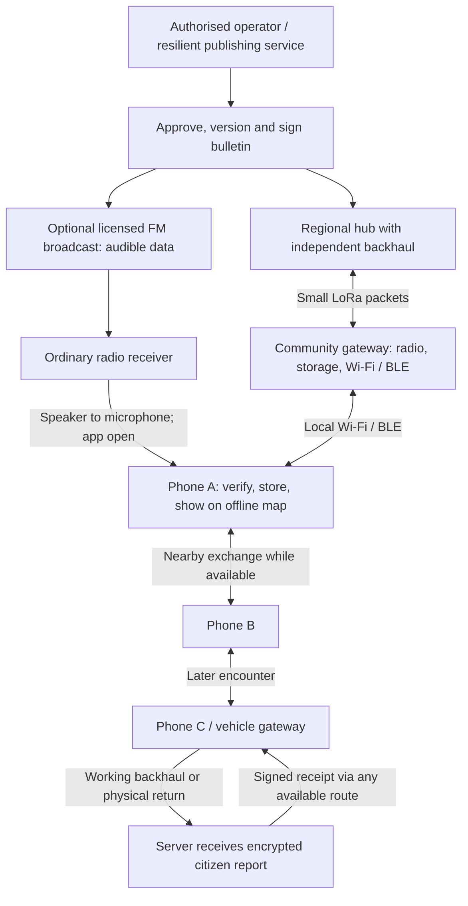

# Atbalsts: practical communications during a cellular outage

Architecture decision memo · 8 September 2026

**Recommendation: build an application that works from local data, exchanges independently verifiable messages over several transports, and uses powered community gateways for dependable relaying.** Use LoRa for small messages within surveyed local areas; use local Wi-Fi and Bluetooth for the connection to phones. Test audible data over existing radio broadcasts as an additional downlink. Expand through regional distribution and known service points.

This is a proposed design grounded in the supplied presentation, the available app code, and primary technical sources. No Atbalsts radio, acoustic, range, battery, or phone-background performance has been measured in this review. Prices, capacities, storage sizes and acceptance thresholds below are planning assumptions unless explicitly identified as observed.

**1. What the current evidence supports**

The supplied presentation's slide 6 describes approximately 10–30 bit/s, P2P forwarding, and a mobile data node. It does not identify a modulation, frequency, radio receiver, tested protocol or measured throughput. Slide 8 explicitly attributes video publication to ePPO. These are claims to clarify; the presentation is source material, not an implementation specification.

I checked GitHub's default branch, `goofis11/palidzi`, at `b7ee07c7e57801cbab1202edbef7b0b798bfcc89`, and the local working branch `fix/r2-atomic-publication` at `60a88a7`. The repository is private. This verifies those code revisions, not the exact revision running at atbalsts.sortium.co.

| Observed in the code | Architectural implication |
|---|---|
| A React/TanStack web application with a service worker caching the public `/72h` page, assets and eligible reference geodata | A useful preparedness foundation; the map and live API responses are not a complete offline application |
| Leaflet basemaps request external tiles/WMS | Add an explicitly packaged offline basemap and local renderer/data source |
| The report form posts to `/api/reports`; local storage keeps receipts after successful submission | Add durable local report storage before attempting transmission |
| No LoRa, Bluetooth transport, native mobile project, or signed offline bulletin implementation found in the reviewed application files | These are new components, not configuration switches |
| A server publication outbox exists in the newer local branch; it is absent from the checked GitHub main tree | Reuse the outbox pattern, but verify its release status and implement transport delivery separately |

Code references: [GitHub service worker at the checked revision](https://github.com/goofis11/palidzi/blob/b7ee07c7e57801cbab1202edbef7b0b798bfcc89/public/sw.js), [local basemap configuration](</Users/kristaps/Documents/New project/palidzi-oauth-recovery/src/lib/basemaps.ts:103>), [report submission](</Users/kristaps/Documents/New project/palidzi-oauth-recovery/src/routes/zinot.tsx:135>), and [local server outbox](</Users/kristaps/Documents/New project/palidzi-oauth-recovery/src/lib/outbox.ts:1>).

The two local public GeoJSON files total **1,345,977 bytes**, approximately 1.35 MB, uncompressed. They contain municipality boundaries and shelter reference data. That is not the size of a complete offline Latvia map, nor evidence that every necessary resource is cached.

**2. The recommended system**

There are three different connectivity problems:

1. **Reaching an isolated region.** A regional hub needs a path from an authorised publisher: surviving fixed internet, an agreed government link, satellite, an engineered radio link, a broadcast receiver, or physical transport. LoRa does not create this upstream path automatically.
2. **Distributing within the region.** A modest number of elevated, powered LoRa nodes exchange compact updates. Public access points cache them and make them available over local Wi-Fi/BLE.
3. **Reaching people away from those points.** Phones carry verified updates and exchange them during encounters. This helps, but arrival depends on people, permissions, battery and app availability.

An isolated municipality also needs the ability to originate authorised local information. Provision a municipal publishing laptop with a hardware-protected, geographically restricted delegated signing credential and a local interface. It must work without cloud login or the central database. Its allowed message types, operating period and approval procedure should be defined beforehand.

Every transport carries the same signed public objects or encrypted private report objects. The app's verification and storage rules do not change when a message arrives through radio, a neighbour, a USB file or the internet.

**3. What receives the signal, and which technology to use**

| Link | Physical receiver and phone connection | Appropriate role |
|---|---|---|
| LoRa in a permitted European SRD band | Separate LoRa radio; a personal accessory can connect by BLE. A community gateway should attach the radio by USB/serial to a local host and serve phones over Wi-Fi/BLE | Compact alerts, resource status, small requests and receipts |
| Local Bluetooth LE | Phone Bluetooth hardware, through native APIs | Discovery and small nearby exchanges |
| Local Wi-Fi | Phone Wi-Fi, using a gateway access point or compatible peer connection | Fast bulletin sync, larger data packages and queued attachments |
| Audible data carried in FM/AM/shortwave audio | A radio receiver first receives the RF signal; its speaker feeds the phone microphone, or its audio output feeds a gateway | Optional broadcast downlink |
| Licensed VHF/UHF or TETRA integration | Approved radio terminal/gateway and operator-supported interface | Potential institutional backhaul where access and continuity are agreed |
| Satellite | A supported terminal at selected hubs | Independent backhaul; requires equipment, service and power |

Ordinary supported iPhones and Android phones should be assumed to have **no usable LoRa receiver**. The microphone hears decoded sound from a separate radio; it does not receive the broadcast RF carrier. Built-in FM access on some Android models is too inconsistent to be a baseline requirement.

Use **Meshtastic-compatible EU radios for the small pilot**, carrying application-signed payloads through the device API. Pin the firmware/configuration and test packet size limits. Avoid assuming the stock chat application, its cache, or its optional forwarding modules implement Atbalsts delivery semantics. Meshtastic provides [serial/TCP/BLE client interfaces](https://meshtastic.org/docs/development/device/client-api/).

For the first deployment, keep the radio topology small and managed, preferably one hop with a few deliberate relays. Compare faster modem settings against maximum range. A broadcast flooding mesh becomes inefficient as retransmissions multiply; adding devices does not necessarily add capacity. Meshtastic documents its [broadcast algorithm](https://meshtastic.org/docs/overview/mesh-algo/).

LoRa and LoRaWAN are different layers. LoRaWAN normally uses gateways and a network server, with gateway backhaul over IP. A surviving public LoRaWAN gateway does not imply that the application still works when its server/backhaul is unreachable. An existing network could be useful if local server operation, power, downlink scheduling and failure behaviour are explicitly supported. [Semtech architecture](https://www.semtech.com/lora/what-is-lora).

**4. The “10–30 bit/s” claim and a sensible audio experiment**

The slide's number should be described as an **unverified design assumption**. It is not the identity of a radio technology.

For a concrete audio candidate, start with **audible MFSK16 modem tones centred within the receiver's normal audio passband**, initially around 1.5 kHz. MFSK16 carries approximately 31.25 information bits/s after its modem error correction, before application framing and text/binary encoding costs. That makes an eventual 10–30 useful bit/s hypothesis plausible, but does not establish it for this application. Test faster MFSK profiles if the broadcast path supports them. [Modem developer's explanation](https://www.w7ay.net/site/Applications/cocoaModem/UsersManual/mfskManual/mfskManual/mfsk16.html), [Fldigi mode table](https://www.w1hkj.org/FldigiHelp/mode_table_page.html).

The practical sequence is:

1. The publishing service produces a compact signed bulletin.
2. An audio encoder adds framing, error correction and an identifiable start sequence.
3. An authorised broadcaster inserts a short audible data burst between spoken messages.
4. A listener opens “Receive radio update” and places the phone near a battery radio.
5. The decoder reconstructs the complete object. Only successful signature verification permits an official update on the map.
6. The phone can later share the original bytes with neighbours.

This approach has precedents: [TIVAR's project documentation](https://sourceforge.net/projects/tivar/) describes Android decoding through a microphone or audio cable; [Shortwave Radiogram](https://swradiogram.net/) describes actual data broadcasts. Those demonstrate components, not a maintained, audited Atbalsts implementation for current iPhones.

**Do not make near-ultrasonic sound the broadcast baseline.** Standard FM programme audio occupies roughly 0–15 kHz, so signals above that range cannot be assumed to survive the broadcast chain. Cheap receivers, speaker response, room noise, processing and phone microphones add further uncertainty. This is distinct from the radio-engineering term HF, which refers to a radio-frequency band. [ITU FM baseband description](https://www.itu.int/dms_pub/itu-r/opb/rep/R-REP-BS.2213-4-2017-PDF-E.pdf).

[ggwave](https://github.com/ggerganov/ggwave) is useful for a quick audible speaker-to-phone experiment. Its documented audible configuration spans roughly 4.5 kHz; it is not automatically suitable for a narrow voice-radio audio channel. Near-ultrasonic phone-to-phone experiments can remain optional; they add little reliability compared with BLE, Wi-Fi or a signed QR exchange.

RDS or another dedicated broadcast data service is a possible later way to avoid audible bursts, but requires compatible data receivers and broadcaster integration. A normal radio speaker does not expose an RDS data stream to the app.

Broadcast reception is **one-way**. A phone cannot reply to the FM transmitter through its microphone. Replies must use a gateway/P2P path, surviving connectivity, or physical carriage.

Broadcast airtime also needs a schedule and a budget. At a delivered 30 bit/s, ten separate 160-byte regional bulletins take more than seven minutes before repetitions. Publish short common alerts broadly, group changes where appropriate, schedule regional content and let gateways cache broadcasts continuously. A household listening briefly can miss the beginning or its region's update. Measure that user experience, not just decode success for an already-running receiver.

**5. Make the messages small without removing their meaning or security**

Use an authority-facing alert model compatible with CAP concepts, then define a compact radio profile. CAP provides useful update, cancellation, geographic and multilingual semantics; full XML need not cross LoRa. A custom compact profile is not automatically CAP-conformant. [OASIS CAP 1.2](https://docs.oasis-open.org/emergency/cap/v1.2/CAP-v1.2-os.html).

Proposed compact public bulletin fields:

- Protocol version, issuer/key identifier and an explicit exercise/real-message distinction.
- Event identifier, revision, issue time, effective/expiry times and cancellation/update relationship.
- Hazard, severity, instruction code and relevant parameters.
- Coordinates with a circle/radius, a predefined area identifier, or a small explicitly transmitted geometry.
- Codebook/package version, optional short text, and digital signature.

Target approximately **120–200 bytes for a simple signed bulletin**, subject to real serialization tests. More complex geometry, long text, delegation certificates or multiple signatures need more bytes or additional packets. The budgets must count all of them.

Use a standard signed-object format such as COSE Sign1 with a supported signature algorithm, for example Ed25519. An Ed25519 signature alone is 64 bytes. Preinstall the public trust material; relay devices must not possess authority signing keys. [COSE specification](https://www.rfc-editor.org/info/rfc9052/), [Ed25519 specification](https://www.rfc-editor.org/rfc/rfc8032.html).

The app can expand “water distribution point; object 241; open until 18:00” using an approved local dictionary. Keep dictionaries versioned and signed: silently interpreting an old instruction code through a different dictionary is a safety failure. Include enough basic hazard/geometry information for a safe generic display when an optional package is missing. Never infer a detailed instruction from an unknown code.

Assuming the stated rates represent **delivered application bytes**, the arithmetic is:

| Complete data object | At 30 bit/s | At 10 bit/s |
|---|---:|---:|
| 160-byte signed bulletin | 43 seconds | 128 seconds |
| 1,000 bytes | 4.4 minutes | 13.3 minutes |
| 100 kB image | 7.4 hours | 22.2 hours |
| 1 MB | 3.1 days | 9.3 days |

These are lower-bound transfer times, excluding any costs not already included in the measured rate. Actual audio framing, text encoding, missed beginnings and repetitions increase latency. A raw modem bit rate must not be presented as delivered application throughput.

**Do not send photos or video through the narrow radio channel.** Preloaded icons and explanatory illustrations are fine. A new photo or video can remain encrypted on the originating phone, travel over local Wi-Fi to a vehicle/gateway, and upload when capacity returns. Send its small report summary first. The UI must distinguish illustration, locally stored attachment and attachment actually received by the centre.

**6. Phone-to-phone exchange: feasible, with an explicit operating model**

Build a native iOS/Android communications layer while reusing suitable React interface and business logic. Bundle the app shell and essential data locally; a wrapper that loads the website remotely does not solve offline startup.

A public gateway should expose a small local sync service, not require the full cloud backend. Joining its hotspot must be an explicit, tested flow, including the phone's “no internet” behaviour. Discover it through declared local-network services, BLE or a QR containing connection information. iOS requires appropriate local-network permission declarations. [Apple local-network documentation](https://developer.apple.com/documentation/BundleResources/Information-Property-List/NSLocalNetworkUsageDescription?changes=_4).

Do not assume a hotspot can transparently replace the existing HTTPS website. A page at a local address has a different origin and cannot simply write the existing website's local database. Browser storage is also subject to eviction. Use a preinstalled app that imports verified objects into its own durable storage. This recommendation follows from [WebKit's origin-isolated storage](https://webkit.org/blog/12257/the-file-system-access-api-with-origin-private-file-system/) and [storage policy](https://www.webkit.org/blog/14403/updates-to-storage-policy/).

Provision distinct gateway identity credentials and an offline-verifiable trust chain for authenticated local sessions; test credential validity across the intended outage. Never distribute the main website's TLS private key to all gateways or teach users to bypass certificate warnings. Public objects still need their authority signatures, even over authenticated Wi-Fi. A portal downloaded from an unknown hotspot cannot establish its own authenticity merely by displaying a “signature verified” badge; a previously installed verifier or a trusted staffed service point is needed.

The baseline user action should be **“Exchange nearby updates” with the app open**, with clear consent and controls for relaying private report envelopes. Advertise a dedicated service, connect, exchange short inventories, transfer missing objects, verify and commit locally. Use BLE for small exchanges and a gateway Wi-Fi network for larger ones. Keep a signed QR/file-transfer fallback for a few important bulletins when pairing fails.

Google's [Nearby Connections](https://developers.google.com/nearby/connections/overview) is a candidate for native offline peer exchange; its SDK handles several underlying transports. It does not provide an automatic delay-tolerant nationwide network, or remove the need for application-level authentication.

Current Apple support matters: **iOS 26 introduced Wi-Fi Aware on iPhone 12 and later**. This is a useful enhancement for compatible devices, not a reason to exclude older phones. Apple's API includes pairing and service-discovery flows; evaluate those interactions before promising frictionless sharing with strangers. [Apple's Wi-Fi API overview](https://developer.apple.com/documentation/technotes/tn3111-ios-wifi-api-overview?changes=_6_5%2C_6_5), [Wi-Fi Aware presentation](https://developer.apple.com/videos/play/wwdc2025/228/).

Background behaviour must be described honestly:

| Situation | Product commitment |
|---|---|
| Both apps open, permissions granted, radios enabled | Primary supported exchange mode; test each platform pairing |
| iPhone communicating with an associated BLE accessory | Some background events are supported; not a continuous-execution guarantee |
| Arbitrary iPhone-to-iPhone encounters with apps suspended | Opportunistic only; no delivery guarantee |
| Apple Multipeer Connectivity app enters background | Its documented advertising/browsing stops and sessions disconnect |
| Android background service | Potentially more capable, but subject to permissions, foreground-service rules and device power management |
| App force-quit, device restarted, battery saving or radios disabled | Explicit test cases; never presume relaying continues |

Sources: [Apple Core Bluetooth background rules](https://developer.apple.com/library/archive/documentation/NetworkingInternetWeb/Conceptual/CoreBluetooth_concepts/CoreBluetoothBackgroundProcessingForIOSApps/PerformingTasksWhileYourAppIsInTheBackground.html), [Multipeer Connectivity](https://developer.apple.com/documentation/multipeerconnectivity?changes=_3), [Android background BLE](https://developer.android.com/develop/connectivity/bluetooth/ble/background).

Initial **test distances**, not guarantees: 5–20 m for phone BLE encounters with people/walls present; 20–50 m for a local Wi-Fi access area. Good outdoor conditions may allow more. Building materials, crowds, device orientation and interference can substantially reduce them.

Always-on relaying belongs primarily on purpose-built gateways and supervised vehicle devices, where execution and power are under operator control.

**7. Store-and-forward and returning citizen reports**

Use a durable database on each phone and gateway. Persist an outbound report before starting any network operation; preserve it across termination and reboot. Track public bulletins, private report envelopes, attachments and receipts separately.

Store-and-forward is an established networking approach; [Bundle Protocol v7](https://www.rfc-editor.org/rfc/rfc9171.html) is a reference for delay-tolerant semantics. Evaluate an existing implementation for hub/vehicle interoperability, but measure its complete overhead before choosing it for tiny radio packets. The application still needs clear event, trust and receipt semantics even if a standard transport is reused.

For public information, exchange an inventory of active event IDs and revisions and request missing versions. Use periodic signed regional manifests/snapshots to detect gaps. A single global “highest sequence seen” is insufficient: receiving a later update must not hide a missed update to a different event.

Deduplication should use a content hash of the immutable signed object plus issuer/event/revision semantics. Verify and render one event version once. Superseded versions and cancellation tombstones must survive long enough to stop old devices resurrecting an alert. Include bounded storage, per-peer quotas, randomised retry/backoff and a forwarding budget. Hop limits help normal operation but cannot stop a malicious radio from ignoring them.

Maintain a hierarchy of queues: trust/revocation information and official urgent updates first; important small citizen reports and server receipts next; routine status later; media and full packages only on larger links. Both directions require reserved capacity. A downlink-only success demonstration is incomplete.

Citizen reports should be encrypted on the originating phone to a centre/report-ingest public key using a reviewed standard construction such as [HPKE](https://www.rfc-editor.org/rfc/rfc9180.html). Relay phones can carry the ciphertext without seeing the person's location, contact details or medical information. Retain metadata minimisation and traffic quotas because encrypted content can still be spam. Keep signing and report-decryption keys separate.

An account should not be required to read official warnings. If unregistered offline reports are permitted, label their identity assurance and route them to verification; do not invent an online identity check. A citizen signature proves possession of a key, not that a sighting or request is true.

Return distinct states:

**Saved on this phone → copied to a relay → received by the centre → reviewed/acted on.**

A relay receipt is not a server receipt. A server receipt is not a promise of dispatch. Sign centre receipts and route them back using the same store-and-forward mechanism. Delivery time is unbounded while no path or physical carrier reaches the server.

**8. Offline maps, new objects and several days without internet**

Ship a small survival package with the installed application: verified instructions, trust keys, message dictionaries, an overview map and essential reference points. Offer a separately verified detailed Latvia map download before a crisis, with visible size, date and completeness. Installation, key provisioning and permission setup should happen before the outage; do not assume an unprepared iPhone can install the app from a neighbour. Staffed information points and ordinary spoken radio remain necessary for people without the installed app.

Proposed storage targets, to measure during the pilot:

| Package | Planning allowance |
|---|---:|
| App, essential instructions, fonts/icons, overview map and core reference points | 50–100 MB |
| Detailed, selected-layer vector map of Latvia | Additional 200–800 MB |
| Bulletin history and reserved private report storage | 20–100 MB |
| Photos/video | Separate user-controlled quota |

These are design allowances, not measured outputs or a claim about existing app size. Full imagery, more zoom levels, routing graphs and multilingual media can increase them substantially.

Store map tiles, fonts, styles and sprites locally. Use licensed offline map data or generate packages from permitted source data. **Do not bulk-download the current public OpenStreetMap tile endpoint**: its policy prohibits offline packages. [OSMF tile policy](https://operations.osmfoundation.org/policies/tiles/).

During an outage, preserve the basemap and update a separate signed event/resource layer. Radio can carry a new water point with coordinates, short label, status and validity, or a circle/small polygon indicating a closure. Full road-network revisions and detailed imagery wait for Wi-Fi, physical delivery or restored internet.

Make ordinary alert updates self-contained wherever possible; a user should not need every preceding revision. For genuinely differential packages, include the required base version and missing-chunk recovery. Apply changes atomically after all checks pass.

Show both the reference package date and each event's last verified issue time. **Expiry means that current status is unknown; it does not mean the danger has ended.** Do not automatically show a shelter as open or remove a hazard merely because no fresh data arrived.

Location can work from satellite positioning without cellular data, but indoor reception, cold starts, jamming and spoofing remain concerns. Provide manual map placement and label location accuracy. The offline assistant should retrieve approved local instructions deterministically; a cloud-based assistant or a server-side fallback does not automatically run on the phone.

**9. Coverage, radio capacity and power**

For budgeting, start with **0.5–2 km in an obstructed urban setting and 3–10 km in rural conditions with reasonable antenna placement**, between LoRa radios. Elevated, clear paths can exceed these figures; basements and body-worn radios can perform much worse. These conservative starting assumptions need site surveys. Semtech's own general examples describe up to about 5 km urban and 15 km rural, which are not service guarantees. [Semtech range discussion](https://blog.semtech.com/what-is-lora?hs_amp=true).

LoRa coverage to a gateway is not direct coverage to ordinary phones. The gateway's local Wi-Fi/BLE area is much smaller. A person outside it needs an accessory or an encounter with another informed device.

Latvia is approximately 64,600 km². Even ideal hexagonal coverage gives about 995 sites at a 5 km radius, 249 at 10 km and 111 at 15 km. The calculation is area divided by 2.598 × radius². It ignores terrain, borders, overlap, indoor coverage, redundant routes, power and capacity; it is not a deployment plan. [Latvian statistical area reference](https://stat.gov.lv/system/files/publication/2025-05/Nr_03_Latvija_Galvenie_statistikas_raditaji_2025_%2825_00%29_EN_2.pdf).

Start with coverage of **named places and populations**: shelters, municipal offices, libraries, medical/resource points, and planned vehicle stops. Report accessible service locations separately from territorial RF coverage and actual people reached.

Latvia's frequency plan provides, for nonspecific SRDs in 869.4–869.65 MHz, up to 500 mW ERP and applicable spectrum-access/mitigation requirements, with a duty-cycle alternative of no more than 10%. Other subbands have different conditions. Use compliant equipment, antennas and settings; do not assume a software power value alone establishes compliant ERP. Confirm the complete deployment configuration with the spectrum authority before field transmission. [National frequency plan, Annex 3, table 8.14, row 54](https://m.likumi.lv/ta/id/338729-nacionalais-radiofrekvencu-plans).

Meshtastic EU868 LongFast is nominally about 1.07 kbit/s and uses one 250 kHz frequency slot in this band. That nominal rate excludes packet and network overhead. A different chat-channel name or encryption key does not create more RF capacity. [Meshtastic radio settings](https://meshtastic.org/docs/overview/radio-settings/).

The standard LoRa airtime formula gives approximately **1.68 seconds for a 200-byte radio payload** at SF11, 250 kHz, coding rate 4/5, eight preamble symbols, explicit header and CRC. This is a calculation, not a measured Meshtastic application transfer.

Using a rounded two-second packet as a planning example:

- A transmitter operating at 10% duty cycle has at most 360 transmit seconds/hour: 180 such transmissions.
- If that bottleneck transmitter sends each unique bulletin three times, only 60 unique bulletins/hour remain before other traffic.
- Reserving half of that airtime for other work leaves around 30 such bulletins/hour.
- A 1% duty-cycle budget would be ten times smaller under the same packet-time assumption.

This is not network-wide capacity: contention, hidden transmitters, receiving while another node transmits, retries and relays reduce practical delivery further. Regional targeting, selective repetition, faster settings on good links and geographic frequency reuse matter more than adding indiscriminate repeaters.

One radio broadcast can be heard by many receivers without per-recipient airtime. Thousands of individual acknowledgements or help requests are a different problem. Do not request one radio acknowledgement from every citizen.

For a public service point, use a local host with USB-connected radio and a separate Wi-Fi access point. Treat the radio's stock BLE link as a personal/maintenance interface. Meshtastic also documents that its ESP32 firmware disables Bluetooth when Wi-Fi is enabled; do not assume both public interfaces are simultaneously available on one cheap board. [Bluetooth configuration](https://meshtastic.org/docs/configuration/radio/bluetooth/).

Set an initial local gateway test target of **20 simultaneous clients and 100 small sync sessions per 10 minutes**. Larger targets, such as 50 concurrent clients, require suitable AP hardware and measurement. Local Wi-Fi clients are not individual LoRa senders; service capacity is limited separately by local sessions, RF airtime, storage and return-link availability.

Power must be budgeted from measured watts. A gateway averaging 3 W needs about **270 Wh of nominal battery capacity for 72 hours** at 80% usable energy. A nominal 20,000 mAh, 3.7 V power bank supplies only about 20 hours at that load. Winter solar output, battery temperature, charging losses and Wi-Fi duty cycle require explicit tests. Low-power radio nodes and continuously running Wi-Fi hosts have very different power profiles.

**10. Security: contain failures instead of trusting the network**

Public bulletins should be readable but authenticated. Private reports should be confidential to the centre. These are separate requirements; “the mesh is encrypted” does not establish either one by itself.

| Threat | Required design response | Residual limit |
|---|---|---|
| Forged warning, changed coordinates or fake all-clear | Verify the authority signature on the complete object before accepting it; bind issuer, content, times, scope and revision | A compromised authorised signer can still sign false content |
| Compromised phone or community gateway | Keep authority private keys elsewhere; reverify received objects on every device; separate maintenance and public interfaces | It can lie on its own display, censor, delay or flood |
| Old valid alerts replayed after cancellation | Persist revisions and cancellation records; exchange signed manifests and freshness state | An isolated device cannot know about a cancellation it has never received |
| Stolen publishing credential | Hardware-protected keys, restricted regional/type delegation enforced by every receiving app, operator authentication, approval controls, audit and exercised recovery | Instant revocation cannot reach a fully isolated device |
| Fake hotspot or malicious peer | Verify objects independently; use authenticated transport where available; end-to-end encrypt reports before leaving the phone | Traffic timing and presence may still be observable |
| Flooding and fake citizen identities | Bound frame sizes, parser work and storage; impose per-peer/traffic-class quotas; reserve official-message capacity | An open offline reporting network cannot eliminate Sybil spam |
| Radio jamming, failed mast, power loss | Diverse paths, separated sites, measured backup power, physical carriage and visible stale-data states | Software cannot guarantee availability under sustained physical interference |
| Clock manipulation or GNSS spoofing | Track last trusted time and monotonic elapsed time where available; resist rollback; expose uncertainty; allow manual location | After long isolation/reboot, exact freshness may be unknowable |
| Parser exploit or malicious map package | Minimal bounded binary schema, strict validation, signed manifests, fuzzing and independent review | Device/OS compromise remains possible |
| Malicious build/update | Signed releases, protected build credentials, dependency review, controlled rollout and rollback/recovery plan | Protecting the signer and release chain remains essential |

Use a long-lived root trust anchor protected offline and a manageable set of scoped operational credentials. Distribute current/next credentials and signed revocation information before predictable rotation boundaries. Define an offline validity period aligned with the intended outage duration. Never silently bypass expiry or signature checks to recover availability; retain access to static preparedness information and label unverifiable updates.

Administrative revocation and report-decryption key rotation must preserve the ability to process legitimate delayed reports. Define retention and receipt expiry rules, avoid broadcasting identifying report metadata, and keep location telemetry disabled unless required for the specific role.

Meshtastic's default public channel uses a publicly known key; its newer private-message security does not make a radio node an authorised national publisher. Put the authority verification above whichever radio system is selected. [Meshtastic encryption documentation](https://meshtastic.org/docs/overview/encryption/).

For nationwide or consequential messages, require strong publication controls and independent approval appropriate to the urgency. Maintain a documented urgent-issue procedure, especially for locally delegated operators. Cryptography verifies who issued a message, not whether the operator's underlying facts are correct.

**11. A realistic end-to-end scenario**

Example: a storm has disabled cellular coverage in a municipality. Its local gateway is powered and still has a surveyed LoRa path to the regional hub. At least that regional hub has independent connectivity, or receives messages through the agreed broadcast/physical route.

1. An authorised operator confirms that a resource point is closed and an alternative is open. The publisher creates event revision 7, with validity, coordinates and instructions, and signs it. The publication and delivery work are stored durably.
2. The regional hub obtains the message and sends it into the local LoRa network according to airtime and priority limits.
3. The community gateway receives, verifies and stores it. Phone A joins the local Wi-Fi service or uses a tested BLE connection. The app verifies the same signed object, applies it to its offline map and shows source and age.
4. Phone A later meets phone B, which never received radio or visited a gateway. Both users open nearby exchange. B requests the missing event revision and receives the original signed bytes.
5. B creates a help request. Its location and details are encrypted locally; the app initially says it is saved on the phone.
6. B copies the request to A or a vehicle gateway. A small envelope may travel upstream by LoRa if capacity and a connected route exist. Otherwise it stays queued until a vehicle reaches a working hub.
7. The centre receives the report, deduplicates it and issues a signed receipt. Human review and operational action are tracked separately.
8. That receipt travels back through available gateways/peers. Until B receives it, the app does not claim that the centre received the request.
9. If the official situation changes, revision 8 or an explicit cancellation propagates in the same way. Devices that missed it show their last verified information and its age.

An awake phone near an uncongested, connected gateway could receive the initial bulletin within minutes. A phone depending on a future encounter might wait hours or never receive it. These are different service classes, not one end-to-end guarantee.

This distinction matters for the presentation's air-threat example: encounter-based forwarding cannot carry a guaranteed seconds-level warning. Use the proposed system first for outage information, resource availability and delayed reports; any time-critical warning role needs its own tested delivery requirement alongside the established official warning channels. Do not derive a safe evacuation route from stale closures or an offline model's guess.

A backpack/vehicle node can combine receiver, retransmitter, cache, local hotspot and data carrier. The vehicle must stop long enough for discovery and transfer. Start with vehicles and fixed sites; a drone adds endurance, radio geometry, payload, aviation and operational constraints without fixing the application's trust or background-execution problems.

**12. Budget options**

All figures below are **planning estimates in EUR, excluding VAT**. They assume borrowed phones/laptops and existing premises where indicated. Labour is valued at an assumed €400–€700 per engineering day; this is a modelling rate, not a Latvian supplier quotation. Donated labour reduces cash spending, not the amount of work.

Hardware price anchors checked during research: RAK's [Meshtastic starter kit](https://store.rakwireless.com/products/wisblock-meshtastic-starter-kit) starts at US$24.99, and Raspberry Pi advertises its [Zero 2 W](https://www.raspberrypi.com/products/raspberry-pi-zero-2-w/) at US$15. These are bare-product starting prices, not complete European deployment costs. Batteries, cases, storage, suitable antennas, adapters, shipping and mounting materially change the total.

Before buying anything, use borrowed phones and a laptop for a zero-additional-hardware test of signed QR/file transfer, local state, stale updates and report receipts. That can reject a flawed message design cheaply; it does not validate radio reception or background P2P.

| Stage | Scope | Hardware/field allowance | Development and other work | Planning total |
|---|---|---:|---:|---:|
| Bench decision test | Two radios, borrowed laptop/phones, audio feasibility and message format | €300–€600 | 5–10 days: €2,000–€7,000 | €2,300–€7,600 |
| Minimum meaningful end-to-end pilot | Six radios, two public gateways, 8–12 borrowed mixed phones; native foreground exchange and return receipts | €1,200–€2,200 including hardware contingency | 25–50 days: €10,000–€35,000 | Approximately €11,000–€37,000 |
| Controlled municipal pilot | Approximately 20 powered service points, regional/vehicle equipment, 100–300 participating residents | €20,000–€50,000 | 80–160 days: €32,000–€112,000; independent review/exercises €10,000–€25,000 | €75,000–€225,000 including 20% contingency |
| Illustrative wider rollout | 500 local service points and 20 regional hubs on existing sites | See calculation below | Production engineering, independent review, operations setup | €0.72–€1.70 million initially; not blanket national coverage |

The bench stage does not deliver the complete native application. The minimum end-to-end stage is a development demonstrator, not a public emergency service. The municipal stage assumes significant reuse of earlier work and targets controlled operation; a procurement requiring formal service guarantees may cost more. Stage totals describe each scope and should not be added without accounting for reused work and equipment.

Minimum pilot bill of materials:

| Item | Quantity/basis | Estimate |
|---|---|---:|
| Complete LoRa kits with suitable antenna, small battery/case | 6 × €60–€100 | €360–€600 |
| Local hosts, Wi-Fi equipment, storage and adapters | 2 × €120–€220 | €240–€440 |
| Additional power/testing adapters | Allowance | €200–€350 |
| Audio receivers/cables | Allowance | €60–€140 |
| Mounts, spares and local travel | Allowance | €150–€300 |
| Subtotal | | €1,010–€1,830 |
| 20% contingency | | €202–€366 |
| Equipment/field total | | **€1,212–€2,196** |

This minimum does not purchase 72-hour backup for two continuously operating full-power hotspots, paid tower access, production certification, new test phones, vehicles, drones or broadcast airtime. Those are added when moving to a deployment.

The wider-rollout example is deliberately transparent: 500 service points × €500–€1,200; 20 regional hubs × €2,500–€6,000; €100,000–€250,000 for installation/training/logistics; €200,000–€450,000 for production engineering/security/operations setup; then 20% contingency. It assumes usable existing buildings, no new national mast network and mostly reusable backhaul. Allow roughly €100,000–€300,000/year as an initial operations placeholder for support, maintenance, batteries, connectivity and drills; obtain operator/site quotes before treating it as a budget.

The least expensive scaling path is likely to combine existing broadcast distribution, selected independently connected hubs and local service points. [LVRTC offers FM transmission, planning and coverage services](https://www.lvrtc.lv/pakalpojumi/raidorganizacijam/radio_apraide/); this is a credible partnership route, not evidence of permission, free airtime or crisis availability for Atbalsts. Existing municipal roofs, power and staff can be more valuable than very cheap radio boards.

Where line of sight and power are available, engineered point-to-point Wi-Fi/microwave can carry far more regional traffic than LoRa. Obtain site-specific quotes and compare it with licensed institutional radio and satellite at selected hubs. Keep LoRa focused on the small-message role.

**13. What to test before increasing the budget**

Use gates that can stop or reshape the project:

1. **No-network startup.** Install all required material, disable cellular service and WAN access while leaving local radios enabled, reboot, open the app and display the map/instructions. Repeat after several days. Check missing/evicted/corrupt packages and unavailable login services.
2. **Signed-message round trip.** Centre → radio → gateway → iPhone and Android → previously uninformed phone → encrypted report → delayed server ingestion → signed receipt. Log the same message ID at every stage.
3. **Phone compatibility.** Test iOS↔iOS, Android↔Android, iOS↔Android and phone↔gateway in foreground, locked, background, low-power, force-quit and reboot states. Include older supported iPhones and multiple Android vendors. Count failures rather than excluding them.
4. **Audio separately.** First prove speaker/cable decoding. Then test the actual intended authorised broadcast and receiver chain, different radios, volume, background noise and phone microphones. Measure complete verified payloads per elapsed minute. Bench playback alone does not prove over-air reception.
5. **RF field survey.** Measure delivery probability, latency, RSSI/SNR, antenna height, obstructions and occupied airtime on urban/rural routes and indoors. Test both directions and at least one relay failure. Never equate the longest successful packet with coverage.
6. **Congestion.** Load local sessions and queues, then test a burst of requests while official alerts continue. Measure queue age and fairness. Simulated clients measure software load; real radios are needed to measure collisions.
7. **Abuse and stale state.** Submit corrupted signatures, altered coordinates, obsolete codebooks, old all-clears, duplicate floods, invalid sizes and forged receipts. Compromise a relay in the test environment and confirm it cannot mint official messages. Test a missing revocation and explain the residual risk.
8. **Power and recovery.** Measure continuous watts, run a 72-hour deployment power test, cut power during writes and recover state. Exercise backup signing, key rotation and an internet return after days offline.

Suggested initial acceptance targets: at least 95% of compact alerts within two minutes and 99% within five minutes **on declared surveyed routes with awake apps, under a specified load**; at least 95% completion for foreground nearby exchanges in 30 seconds after permissions/setup; zero acceptance of forged official messages in the test suite; durable requests across restart; no “received by centre” state without a valid receipt.

Use at least 100 repeated opportunities per important link/state and report sample counts and uncertainty. These pilot targets are not sufficient evidence for a safety-critical SLA. Record failure clusters and device-specific exceptions rather than averaging them away. If iPhone background behaviour misses the required threshold, retain the explicit foreground exchange and gateway model.

Conduct interference/abuse tests through simulation, conducted connections, shielding or an appropriately authorised facility. Do not intentionally jam public radio spectrum.

**14. What to correct before replying to IDC**

- Replace slide 6's unconditional radio speed with a named **proposed transport** and measured-result placeholder: “Compact signed alerts through external LoRa gateways; experimental audible radio-data reception; throughput and delivery to be established in a pilot.”
- State that external radio hardware is required, except for a microphone receiving sound from an ordinary radio. Explain the short Wi-Fi/BLE connection to the phone.
- Distinguish foreground nearby exchange from opportunistic background operation, particularly on iPhone.
- Describe the map as preloaded reference data plus small signed event/resource updates. Remove any implication that photos/video or full maps travel at 10–30 bit/s.
- Clarify that the offline assistant uses an installed, approved knowledge package.
- Correct the ePPO reference. Its indexed official instructions describe choosing a threat type, providing location and pointing the phone; the current developer listing describes threat reporting. I found no primary evidence supporting the presentation's video-upload or LoRa/P2P architecture claims. Cite it only as an example of citizen observations supporting an institutional response unless the developers provide further evidence. [ePPO official site](https://eppoua.com/), [developer's Google Play listing](https://play.google.com/store/apps/details?hl=en&id=ua.quick.brpg.pathfinder). The official website blocked direct retrieval in this review; its indexed instructions and accessible store listing are a limited evidence base.

There are deployed components: Meshtastic radio messaging, Briar's offline peer synchronisation, and data-over-radio experiments. [Briar describes Bluetooth/Wi-Fi synchronisation](https://briarproject.org/how-it-works/); it should not be represented as proof of automatic forwarding among arbitrary iPhones. No reviewed source establishes this exact combined Atbalsts architecture at Latvia scale or under sustained hostile interference.

**15. Implementation sequence for the existing app**

Keep one public event model and add bounded components:

| Component | Work to implement | First proof |
|---|---|---|
| Publishing/export service | Turn an approved event revision into an immutable signed compact object; commit durable delivery work with the publication | Repeated delivery cannot change the signed bytes or create a second event |
| Shared message library | Strict schema, serialization, signature/credential checks, codebook handling, event revision rules and receipt interpretation | The same object yields the same result on iPhone, Android and gateway |
| Native app shell and local store | Bundle reusable React UI, use durable local storage and add native BLE/Wi-Fi/microphone bridges | Cold start and map display without cloud, DNS, login or remote scripts |
| Offline map/data pack pipeline | Produce permitted vector packages, manifests, hashes, versioned reference objects and update recovery | A partial/corrupt download never replaces the last complete working package |
| Gateway daemon | USB radio adapter, local sync server, independent queues, deduplication, priority, quotas and power/restart recovery | An attached radio is replaceable without changing the phone's message format |
| Report ingest and receipts | Accept delayed encrypted reports, deduplicate, preserve reported time and identity assurance, issue recipient-verifiable receipts | Many copies of a request create one report; “received” requires server evidence |
| Operational console | Distinguish publication from each gateway's receipt and from user/device acknowledgements | No inference that every resident received a warning from one gateway's success |

The existing server outbox stores event IDs and versions. The radio export must bind delivery to an immutable snapshot of that exact revision; looking up only the mutable latest event during a retry could send different content under the same delivery task. Preserve the current protection against caching private authenticated pages. Build an explicit offline data store instead of broadly relaxing the service-worker allowlist.

Suggested order: (1) protocol and offline startup, (2) gateway-to-phone delivery, (3) delayed reports and receipts, (4) foreground phone-to-phone exchange, (5) independent audio feasibility, then (6) background optimisation and regional deployment. Audio experimentation can run without committing the rest of the app to a particular modem.

**16. Assessment of the mentor's informal message**

The message is useful as a requirements critique. Its core distinctions agree with the primary evidence reviewed here: external LoRa receivers, separate phone/radio coverage, foreground-first P2P, signed alerts, private reports, honest delivery states and a complete demonstration.

I would qualify or extend it in these ways:

- “Technically possible” applies to the components and a bounded system; it does not yet establish a reliable national service.
- Its range and approximately 1 GB storage figures are allocations to test. Require only a small essential package by default; make larger maps optional and pre-downloadable.
- Its 28–84 messages/hour calculation for 160 bytes at 10–30 bit/s is arithmetically reasonable after rounding. It assumes the stated rate already represents the relevant continuously available shared capacity. It is not a LoRa network-capacity measurement and cannot replace the airtime, duty-cycle and contention analysis.
- An ordinary Wi-Fi hotspot is a useful transport. Supplying a trusted app, maintaining its local state and solving permissions/HTTPS origin boundaries require additional implementation.
- A national alert cannot reach a completely disconnected local mesh without an independent feed or a physical carrier. Likewise, local publishing needs predelegated authority if cloud services are unavailable.
- A radio board's small price understates the costs of powered gateways, secure native software, maintenance and exercises. The minimum field kit is affordable; the verified service costs more.
- No signature scheme prevents jamming, establishes the truth of a citizen observation, or instantly revokes an unknown stolen key on an isolated phone.

The mentor's note is not treated as a primary source or evidence of measurements.

The next concrete decision is to fund the small end-to-end pilot and agree on an institutional message owner, one municipality, a permitted radio configuration, a broadcast-testing partner if available, and measurable delivery conditions. Scale the parts whose measured results justify it.

**Calculation record.** Transfer times, LoRa airtime, idealised site counts, energy and budget sums are reproducible with [the accompanying Python calculation script](</Users/kristaps/Documents/New project/output/atbalsts-offline/radio-budget-calculations.py>). It uses analytical assumptions and performs no radio or device test.
