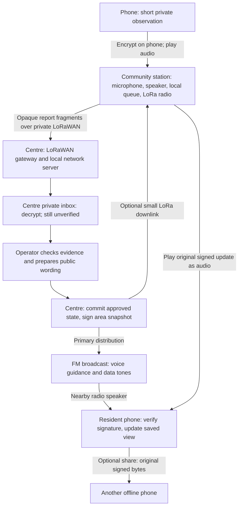

# Atbalsts blackout architecture — small, centre-led pilot

9 September 2026. This replaces the broader peer-mesh proposal with a smaller design. The protocol proof is implemented and tested locally; production integration and LoRa hardware are not implemented.

**Residents read the latest centre-issued situations and shelter status. They can submit a short private observation for review. Only the centre publishes public facts.**

## Data flow

The **community station is the bridge** for the 95% without LoRa devices. For the first pilot, use a staffed laptop or small computer with a microphone/speaker and a provisioned LoRaWAN end-device radio. The phone uses its normal speaker and microphone. A visitor needs no Bluetooth pairing, Wi-Fi login or radio equipment. The app and its public keys must already be saved on the phone. People without it use spoken announcements, signage or a staffed desk.

Use **private LoRaWAN with the concentrator/gateway and network server at the centre**, connected locally and running on backup power. Community stations are end devices in LoRaWAN terminology, even though they act as bridges for residents. This avoids relying on an internet service or backhaul between a distant gateway and a cloud server. ChirpStack has a gateway OS variant that includes a local network server. [Architecture](https://www.thethingsnetwork.org/docs/lorawan/architecture/), [ChirpStack](https://www.chirpstack.io/docs/chirpstack-gateway-os/).

LoRa is principally the report return path. FM remains the main public broadcast path. Optional LoRa downlinks carry a station's local snapshot and delivery receipts; avoid sending a national database to every station. Fragment 314-byte reports to the allowed payload at the actual data rate; use bounded reassembly, retries and persisted LoRaWAN counters. Measure capacity, coverage and airtime with the selected regional configuration. Public radio alerts get a reserved service budget; a report flood must not monopolize it. Regional duty-cycle constraints still apply to private networks. [Airtime constraints](https://www.thethingsnetwork.org/docs/lorawan/duty-cycle/).

## What is protected, exactly?

| Object | Mechanism | Acceptance rule |
|---|---|---|
| Public area snapshot | COSE_Sign1, Ed25519, application-bound signature | Installed centre key, correct area/registry/epoch, complete small-area schema, newer sequence |
| Resident observation | HPKE Base: X25519 + HKDF-SHA256 + AES-128-GCM | Relay carries sealed bytes; only designated centre private key opens them |
| Receipt, next integration step | Centre-signed hash of received envelope | Issue only after durable inbox commit; a station ACK alone is not centre delivery |

Provision **two different centre key pairs**: a signing key and a report-decryption key. Residents and community stations get public keys only. Keep private-key operations in the centre application, outside the public website bundle. Preload authenticated public keys with the offline app; a nearby device cannot replace them. One centre, one area owner and pinned keys are enough for the pilot. Add root-signed key rotation/revocation before a wider rollout. An isolated device cannot learn a revocation until it receives it.

HPKE encrypts on the originating phone, before queue storage. The tested envelope has no outer incident type, reporter name, coordinates or text. It does expose a recipient key identifier, fixed size, timing and repeated-envelope identity. Encryption does not hide that sound is being transmitted. The author and whoever possesses the centre private key can read the content; a compromised endpoint defeats that boundary. Later compromise of a retained recipient private key can expose recorded old reports. There is no geographic lock that decrypts only when a device physically reaches the centre. [HPKE security properties](https://www.rfc-editor.org/rfc/rfc9180.html#section-9).

## Reporting is an untrusted input channel

Anyone who has the public encryption key can manufacture a perfectly valid encrypted lie. Re-encryption also produces new IDs, so hash deduplication does not stop a flood. **Successful decryption must never mean verification.**

For the pilot:

- Accept reports only during a staff-opened intake window at a community station. Route only through enrolled LoRa nodes. This controls admission without giving staff a decryption key or asking every resident to create an account.
- Limit reports to a category, observation time, location and one short sentence. No attachments, contact details, public comments or executable content. The tested envelope is always 314 bytes; the example queue holds at most 20 reports. Those quotas are pilot settings, not a demonstrated capacity target.
- Enforce per-station rate, storage and airtime budgets and a separate centre inbox budget. A malicious or compromised enrolled station can still exhaust its allowance; quotas limit damage rather than establish truth. Radio jamming remains possible.
- Decrypt into a private inbox; render text literally, without HTML, link execution or automated tool actions. Staff must corroborate significant claims. Do not promote reports based on volume alone: many reports may come from one attacker.
- An authorized operator writes and approves the public statement. Commit the approved revision and signing job together; a separate signing step reads that committed revision. Every existing publication endpoint must use this gate. Incoming reports cannot supply a `verified` flag, publisher identity or public status change.

The app can reject untrusted public updates; it cannot prevent arbitrary people transmitting arbitrary audio. “Harmless” here means excluded from public state and bounded in resource use, not that unknown text is inherently safe.

## Resident experience

**One home screen:** selected area, age of the centre's latest known update, short situations and nearby shelters. Main action: **Get update**. Secondary action: **Report an important observation**. No account, raw packets, bitrate display, maps dependency or mesh settings in this view.

Get update opens a listening session with a clear stop button. Show reception progress separately from verification. Only a fully verified area snapshot changes the view. Stop the microphone afterwards. A completion sheet may offer **Share this update**; it sends the original signed object and preserves its original age. It is a convenience, not a requirement that residents carry other people's reports.

Reporting asks what, where and when; it encrypts before saving or playing audio. At a station the person taps **Send at station**. Distinguish “Saved on your phone”, “Station has a copy” and, once signed receipts exist, “Centre received”. None means the claim was verified or that help was dispatched. Make reporting optional and secondary to receiving public information.

Expired information remains visible as **last known, outdated**; an expired “open” status must not look like a current assurance. Offline devices can know only the latest authenticated state they have received, not prove that nothing newer exists. Derive age from the centre's issue time; receiving an old relay must not refresh it. If the clock is unreliable, show that age is uncertain.

## Minimal implementation order

1. **Offline reader:** fix the documented service-worker cache conflict; package the app, stable shelter registry, area membership and public keys. Test cold reopen without connectivity. Use one verified local state store for both online and audio imports.
2. **Centre publisher:** sign complete small-area snapshots from explicitly approved state. Retain exact signed bytes; atomically persist revisions and displayed state. The proof caps each area at 32 shelters and 4 brief situations, with a 1 KB total cap. Predefine smaller areas if necessary; never silently omit a record. Full snapshots remove the need for delta recovery in the first pilot.
3. **Private return path:** integrate the tested HPKE envelope, a centre-only private inbox, and one staffed station. First demonstrate phone audio → station → centre using a local connection; then replace that segment with LoRaWAN fragmentation, authenticated node admission and durable retries. Add centre-signed receipts before claiming end-to-end delivery in the UI.
4. **Close the loop:** receive a report, review it offline, issue a separately signed public update, broadcast it and observe another offline phone update. Repeated old audio must not roll state back. A false report must leave the public view unchanged.
5. **Field acceptance:** use real Android and iPhone receivers, a real radio speaker, late starts, interrupted audio, station and centre restarts, full queues, duplicate/reordered LoRa fragments and malicious input. Record exact sender bytes and successful complete imports. Test the cold-start/offline upgrade path and power loss during storage. Agree a listening window, then measure completion distributions and battery use; do not infer them from clean software WAV tests.

Current Atbalsts hooks are the centre publication workflow around `src/lib/center-store.ts` and the routes in `src/server.ts`. The live radio exercise remains an exercise: its public test signing seed cannot establish production authority, and its separate local store is not the main app's verified state. No production files were changed for this proof.
