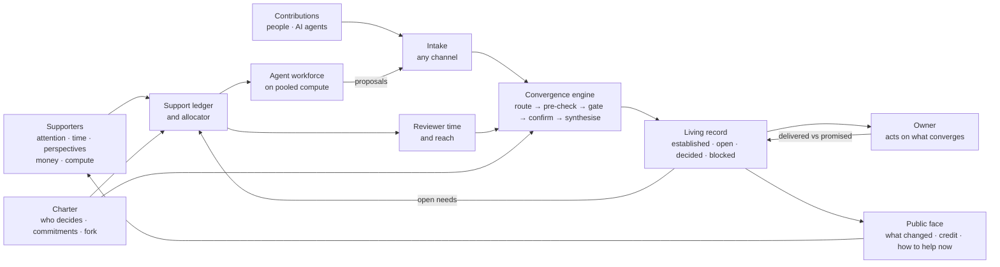

# The mission portal

23 September 2026. A picture, an architecture outline and the lessons of earlier attempts.
It builds on [VALUE-AND-SCOPE.md](VALUE-AND-SCOPE.md): this is where the group trust core
leads once a mission opens up to everyone who backs it. Sources for every precedent are in
[research/precedents.md](research/precedents.md).

## The picture

Today a cause lives in pieces: its knowledge in papers, threads and private AI chats, its decisions in meetings, its supporters in follower counts, its money on a crowdfunding page and its volunteers in a chat group.

Nothing holds these together. Goodwill leaks away, every newcomer starts from zero, and
the cause can do only what its few organisers can keep in their heads.

A **mission portal** is the cause's home. It holds a charter, signed by an owner able to act for the mission, that
says:

- what the mission is and what success looks like;
- who decides, and who can stop something done in its name;
- what the owners commit to act on;
- how the charter changes, and how to fork it, including to a new owner if this one walks away.

It keeps a live, honest account: what is established and from where, what is open, what
is blocking, what was decided, and who stands behind it. It turns every kind of support
into checked progress on the open questions and needs.

**It runs on support.** People who back the mission bring five kinds of fuel: attention, time and skills, perspectives, money, and compute that powers AI agents working for the mission.

The portal routes that fuel to where it counts, checks what comes back, and shows
everyone what changed. Less support means less capacity, but nothing already
established is lost.

**Why this matters.** It moves the ceiling on what a cause can achieve. Today the limit is
*what its organisers can coordinate*; with the portal it becomes *what its supporters are
willing to fuel and its reviewers can check*. Each ingredient has already worked at scale on
its own:

- Wikipedia converged open contribution into the world's reference work.
- eBird has gathered 2 billion observations through structured entry and automated filters,
  and a Science paper mapped population declines from 36 million of them.
- Folding@home's supporters built the first exaflop computer in weeks in 2020.
- Barcelona's participatory budget had an owner commit money in advance and report about 90%
  of accepted proposals executed (its own figure).

Nobody has combined them: support turned into both judgment and work around one mission,
with an owner bound to act on the result. Nothing we found has sustained that outside
crypto-native or code-centric communities.

## Why now, and what does not change

AI changes three things:

- **Support can become labour.** A supporter's compute credit can run an AI agent on a
  sub-question. That is loosely coupled work, which pooled compute should suit (inferred from pooled training; not yet shown for agents):
  INTELLECT-1 kept GPUs pooled from 30 providers busy 83% of the time (96% within the US).
- **Checking gets cheaper per item.** Triage, pre-checking a claim against its source,
  and spotting duplicates cost about $0.0001 per decision on a typed-judgment API. That is the step that stalled HOT's validation and saturated Optimism's juries. Whether it is accurate enough to trust is the hypothesis this project tests first.
- **Synthesis gets cheaper.** Clustering and summarising thousands of contributions works,
  when people curate and ratify the result: participants in OpenAI's Democratic Inputs projects found that efficient and legitimate, though a coherent output from diverse views stayed hard.

Four things stay as hard as before: someone must be legitimately committed to act; human judgment stays scarce (juries saturate at a few hundred items); attention fades after the spike; and capture.

AI makes three of these worse. It floods reviewers with more to check, it draws attention away from the commons it learns from (Wikipedia's human pageviews fell 8% in 2025), and it makes
building fake trust cheaper (an inference, not yet measured).

## Architecture

| Part | What it does | The failure it prevents | Built today? |
|---|---|---|---|
| **Charter** | Says what the mission is, who decides and who can stop, what the owners commit to act on, how to change the rules, how to fork. | Output nobody is bound to act on (vTaiwan, Climate CoLab); actions in the mission's name that most of the movement opposed (Extinction Rebellion at Canning Town); rules set without those affected. | No |
| **Living record** | Findings, open questions, needs, decisions and results, each carrying its status (said, kept, checked, decided or disputed), source, confirmer, audience and history. | Confident noise; losing why something was decided. | Partly: append-only log, judgment records |
| **Intake** | Takes contributions from the web, email, messengers, repositories and AI agents (via MCP), and asks for structure at the moment of contribution where possible. | Unusable mass input. eBird shows structure at entry plus automated filters works. | Partly: web, email and Telegram adapters |
| **Convergence engine** | Routes each contribution to the question or need it addresses, pre-checks its source, catches duplicates and contradictions, then accepts, queues for a person or asks one question. People confirm; consequential items get several overlapping reviewers. AI drafts syntheses; people ratify them. Each synthesis says who took part and which affected groups are missing. | Checking that doesn't scale (the HOT validation backlog, a median 16 hours of review per Optimism badgeholder); faked checking (Bittensor). | Partly: the gate, the coordinator queue, cheap typed judgment |
| **Support ledger and allocator** | Records who backs the mission and how. Turns support into capacity: an agent budget, funded reviewer hours, reach. Allocates by stated need and evidence, not popularity, with damping and fake-account defences. Stakes cannot be bought or sold. | Resources that follow reach instead of need (GoFundMe); popularity over impact (Optimism); fake supporters (Gitcoin); buyers taking over the treasury (Aragon). | Partly: matching and outbound asks |
| **Agent workforce** | Runs sub-questions, drafts and pre-checks on pooled compute, with work queued and ready so a surge lands. Agent output always enters as a proposal. | Surges with nothing to do (Folding@home 2020); AI output taken as true. | No |
| **Public face** | Shows the state of the mission, what changed this week, what is blocking, and credit for every contribution. Gives a concrete ask straight after someone shows support. Reports delivered against promised, and what the owner did with each converged result. | Contributions that never land (Wikipedia newcomers, Community Notes); support that ends at a click (petitions). | Partly: the public initiative page |

The boundaries already built for the prototype run through every part: identity, audiences,
authority, honest failure and an audit trail ([CONSTRAINTS.md](CONSTRAINTS.md)).

## The flywheel, and the rules that keep it honest

Support buys capacity, capacity produces checked progress, and visible progress and
credit earn support. Five rules keep the loop from repeating history:

1. **Support buys capacity, never truth or authority.** Backing can signal which questions matter; stated need and evidence decide where effort
   goes. Only evidence decides what is established, and only the charter decides who
   decides.
2. **Checking grows first.** Every increase in contributions is matched by reviewer
   capacity: funded reviewer hours and AI pre-checks. The queue of unchecked work is the
   first number on the dashboard.
3. **Design for a funded core and a cheap periphery.** About 10% of people do 80% of the
   work (Polymath, Zooniverse). Pay the core. Make the first contribution easy and let it
   land within days.
4. **Influence is visible and bounded.** Nobody can buy a stake. Trust to accept
   contributions is spread across several people and can be withdrawn. Pressure to hand
   over that trust is treated as a warning sign (the xz backdoor).
5. **Plan for the spike and the fade.** Keep ready-to-run work queued for surges, and make
   the record survive when attention leaves. Publish it so that reuse, including by AI answer engines, links back to the mission.

Three things to partner for, not build: legal custody of money (the Open Collective
Foundation dissolved over it), payments, and identity verification. The portal itself needs revenue that does not come out of the causes it serves (Gitcoin's Grants Stack wound down).

## Previous attempts

| Attempt | What it proved | Where it stalled | What the portal takes |
|---|---|---|---|
| **Wikipedia** (2001–) | Open contribution can converge into a trusted reference. | Active editors peaked in 2007; quality tools rejected newcomers. Human pageviews fell 8% (Mar–Aug 2025 vs 2024) as AI summaries answered instead. | New contributors' first work must land, and consumers must send attention back. |
| **Open source** (xz, 2024) | Where checking is cheap, it works. | 60% of 400+ surveyed maintainers are unpaid (vendor survey). A patient attacker earned merge rights and planted a backdoor. | Pay and spread the curator role; the right to accept contributions is the attack surface. |
| **OpenStreetMap** (2004–) | Volunteer data became infrastructure: Apple, Microsoft and Facebook paid for 17M+ edits in five years. | Corporate teams came to dominate edits where they worked. | Keep governance separate from contribution volume. |
| **MIT Climate CoLab** (2009–2022) | 125,000+ members, 150+ selected solutions (its own figures). | No published measure of implementation; spun out as a commercial contest platform. | Contests end at a prize list; an owner must carry the result out. |
| **Polymath** (2009–, now dormant) | 6 of 16 projects published. | Depended on a few star hosts. | Build for a committed core plus an occasional periphery. |
| **vTaiwan / Pol.is** (2014–) | About 80% of deliberations led to some government action (its own count). | Never binding; political support faded. | Agree the uptake path before collecting input. |
| **Participatory budgeting: Reykjavik, Barcelona** (2011–) | An owner who commits money in advance gets follow-through: Barcelona accepted 71% of 10,000+ residents' proposals and reports about 90% executed (its own figure). | Lasts only as long as the owner's budget and will: Barcelona's budget was cut from €75m to €30m; Reykjavik paused after 2022–23. | Commit before collecting input; let the mission fork to a new owner if this one walks away. |
| **Community Notes** (2021–) | Bridging across disagreement builds cross-partisan trust, and shown notes cut the spread of false posts. | Only about 10% of notes are shown, and falling; getting a note published is what keeps writers writing. | Consensus rules must not starve contributors of feedback. |
| **LiquidFeedback, German Pirate Party** (2010–13) | 13,836 users took part in liquid democracy. | Debate over 38 "super-voters" eroded legitimacy, though they mostly voted with the majority; use fell sharply. | Make influence visible and bounded from day one. |
| **Collective Constitutional AI; OpenAI Democratic Inputs** (2023) | The public can write AI rules; AI aggregates, people ratify. | One-off events, with uncertain uptake. | Run repeated rounds and keep a living document. |
| **Petitions: change.org, Avaaz** | A small ask aimed at a named target can win. | People who signed publicly were no more likely to donate or volunteer later (JCR, 2014); an AI writing tool changed 1.5M petitions' text but not their outcomes. | Count outcomes; follow support immediately with a concrete ask. |
| **Occupy; Occupy Sandy; Extinction Rebellion** | Crowds self-organise fast: Occupy Sandy put 60,000 volunteers in the field, four times the Red Cross. | No legitimate way to decide or to stop; burnout after the surge. | The charter must say who decides and who can stop. |
| **Kickstarter; GoFundMe** | Money given for a concrete deliverable mostly delivers (about 9% of funded projects failed, in a study Kickstarter commissioned). | Resources follow the asker's reach, not their need. | Report delivered against promised; allocate to need, not reach. |
| **Zooniverse; eBird; HOT Tasking Manager** | Micro-contributions converge: eBird has 2 billion observations screened by automated filters; Zooniverse drew 129,500 unpaid hours from 100,386 people in 180 days. | A validation backlog; activity spikes at launch and then declines. | Structure at entry, automated checks, reviewer capacity with a budget. |
| **SETI@home; Folding@home** (1999–) | Support becomes compute fast: an exaflop in 2020. | Work ran out at the peak; capacity fell to about 1% of it later; the small core team was the limit. | Fund the core first; keep work queued; expect the fade. |
| **Prime Intellect INTELLECT** (2024–) | GPUs pooled from 30 providers in five countries stayed 83% busy (96% within the US) training a 10B model. | Tightly coupled training moved back to one data centre. | Use supporters' compute for agent runs and checks, not training. |
| **Gitcoin quadratic funding** (2019–) | Over $50M reached 3,715 projects. | Fake accounts forced identity scoring; its round-running software wound down in 2025, on unsustainable economics (per a secondary review). | Anti-fake defences from day one; fund the platform itself. |
| **Optimism retro funding; Deep Funding** | Paying after the fact reaches a long tail; AI can propose allocations. | Juries saturate; the human ground truth is thin and noisy. | Narrow scopes, verified impact, several reviewers per item. |
| **Bittensor** (2021–) | Token rewards draw capacity. | Some validators copied others' scores instead of checking; an $8M theft through a tampered package. | Verification is the product. |
| **The DAO; Aragon; VitaDAO** | Supporters pool money fast. | Hacks; treasury raiders; reporting money raised rather than results. | No buyable stakes; count answered questions, not funds raised. |
| **Open Collective Foundation** (–2024) | Public budgets work at scale. | Custody and compliance cost more than its 5% fee; it dissolved. | Partner for legal custody. |

## First step

Build it in the order the evidence supports, reusing what exists:

1. **The trust core on one group:** the living record and the convergence gate, used by
   this project itself (its documents and its two agents) as mission number one.
2. **One real mission with a committed owner:** a policy team's question, or a
   municipality's decided project. The charter is signed before any input is collected.
3. **The public face and the support ledger**, counting attention and compute first.
   Money comes later, through a custody partner.
4. **The agent workforce** funded by supporters' compute, with the review queue as the
   governing number.
5. **Open contribution** once the record and reviewer capacity can absorb it.
